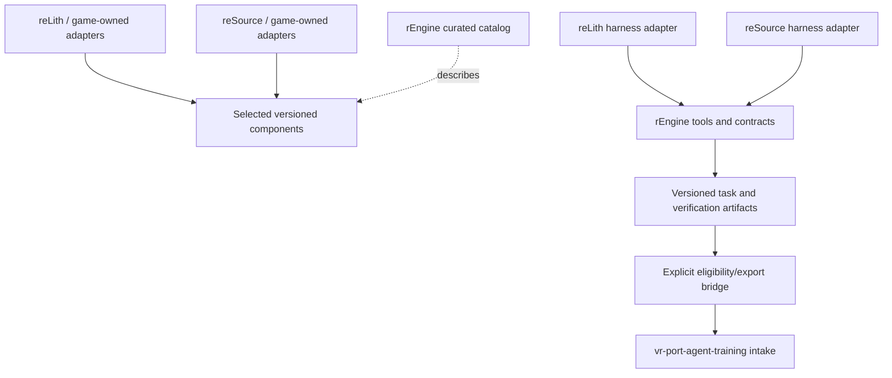

# Architecture

Status: proposed decomposition constrained by the owner's requirement for independent projects.
No common runtime, plugin ABI, ECS, renderer, physics SDK, or model provider has been selected.

## Ownership

| Boundary | Owns | Consumer retains |
| --- | --- | --- |
| rEngine harness | Task/session contracts, evidence envelopes, reusable checks and templates | Local feature truth, commands, policies and acceptance gates |
| rEngine catalog | Capability descriptions, source provenance, reviewed version references, integration recipes | Dependency selection and upgrade timing |
| Reusable component | A narrow documented API, standalone tests, versioned releases | Host allocation/threading/lifecycle/axis conventions through explicit seams |
| Engine adapter | Translation between a shared capability and the host | ILT interfaces or Source scripting/entity behavior, ECS and game policy |
| Training bridge | Proposed export of eligible immutable evidence | Training repo's split classification, rubrics, grading and readiness decision |

Component source may live in an independent repository, as iklib and infra-vr already do.
Inclusion in the catalog does not transfer source ownership or claim universal compatibility.

## Dependency direction

The engine may build selected library source, but libraries must not import its internals.
Harness tools operate on declared inputs through adapters. They do not become dependencies of
game simulation or require the training stack to launch a game.

## Architectural constraints

1. A component must be consumable without building unrelated components or checking out another
   game. Test target names and build options must not collide with the consumer's namespace.
2. Game frameworks remain local choices. No universal entity object, game loop, allocator,
   coordinate convention, rendering API, or physics world is introduced merely to share a tool.
3. Host types stop at the adapter. A shared math/IK seam declares units, basis, pose space,
   quaternion layout, ownership, lifetime, thread use, and optional capabilities explicitly.
4. Build helpers call the host's actual build/gate commands. They preserve failure, skip,
   infrastructure error, and pending manual evidence as different results.
5. Shared tool output can report facts; it cannot silently flip a host feature to passing.
6. Dependencies use reviewed immutable revisions/checksums. Developer overrides are explicit
   local configuration and recorded in run evidence. The catalog is not a substitute for a
   consumer lockfile. No implicit sibling lookup or network access belongs in the contract.
7. Runtime extraction preserves host behavior first. Capability additions and behavior changes
   are separate slices with separate evidence. Hosts upgrade and revert independently.
8. Tests of a shared library prove its contract; host integration tests prove its use. “Works
   in both engines” requires evidence from both, and shared reLith changes need per-game checks.
9. Borrow reusable workflow patterns, not every donor rule. One canonical agent instruction file
   and log per repo avoid divergent Claude/Codex histories.
10. Training exports are explicit and classified. Withheld fixes, protected tests and frozen
    evaluation material never become ordinary agent context through a shared index or catalog.

## Initial files and future placement

| Path | Current or planned responsibility |
| --- | --- |
| `tools/` | Current local inventory helper; reusable tools arrive only through reviewed features |
| `docs/specs/` | Charter now; feature specs before implementation |
| `docs/source-inventory.json` | Dated read-only inspection metadata; not dependency pins |
| `docs/features.proposed.json` | Review inventory until owner review activates `features.json` |
| `docs/integration-plan.md` | Host-owned migration sequence and required evidence |
| `contracts/` (future) | Versioned schemas and fixtures justified by the first consumers |
| `catalog/` (future) | Curated entries and conformance evidence |
| `adapters/` (future) | Development-tool adapters; runtime glue usually stays with the host |
| `templates/` (future) | Minimal agent-neutral project harness and optional native wrappers |

Do not create empty runtime modules to imply progress. Introduce each directory with its first
complete artifact. Broad design rationale lives here or in a spec; file-local notes use sidecars.
