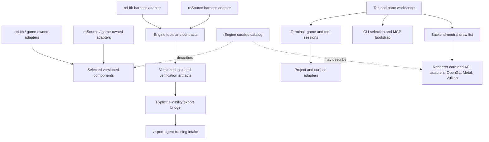

# Architecture

Status: proposed decomposition constrained by the owner's requirement for independent projects.
No common runtime, plugin ABI, ECS, renderer, physics SDK, or model provider has been selected.

The primary product is the quality library base clarified in charter D07. Each game composes a
selected set of implementations around its own needs; AI can author its integration and game
code using explicit library contracts and executable examples. Harness tooling supports the
quality and maintenance of that base. [Library quality](library-quality.md) defines the proposed
admission questions and evidence.

The owner also requested an IDE/orchestrator. Its UI arranges project views and live sessions;
its agent launcher selects the CLI; MCP bootstrap remains in progress. See the
[orchestrator spec](specs/002-orchestrator.md). The GUI is a consumer of reusable components and
project adapters; engines and libraries remain independently usable. The desktop GUI is C with
microui (owner decisions D26–D27). Electron and embedded browser application runtimes are excluded.
An optional later web interface consumes the same workspace contracts independently. The existing
Node/node-pty service and SDL2 game adapter supply migration contracts; native GUI qualification
must repeat the actual workflow. Earlier Electron results do not qualify the replacement.

The [orchestrator handoff](specs/058-orchestrator-handoff.md) binds a checkpoint to an explicit
local Codex conversation and project. A retained bootstrap waits for its native view to be
attached and presented before starting the CLI. Native reload flushes drafts/layout and rebuilds
the desktop while the service retains the same sessions. The handoff capability is versioned
in service state; old services cannot silently launch an ungated continuation. Agent conversation
resumption and the calling application's goal scheduler remain separate responsibilities.

The [layered supervisor](specs/065-layered-workspace-updates.md) retains the original PTY host
and replaces workspace workers, native views and MCP tool workers independently. Preparing and
probing precedes detachment; failures preserve or recover the previous view. Existing streams
finish through their prior worker. Original host/supervisor protocol migrations require quiescence.

Project windows (spec 069) add explicit origin/project/agent bindings, independent layouts and a
durable two-root report link. The supervisor is their sole state writer. Its narrow native control
pipe supports inspection, focus and graceful close; production control does not type into panes.
Reports are polled data with retry keys and cursors. They never start an agent turn or retarget MCP.

## Ownership

Charter D24 sets the powered-by minimum: at least one curated capability at a pinned version
with passing game integration checks. The IDE and shared harness remain optional. Evidence and
compatibility claims are scoped to the actual game/platform/profile, with independent upgrades.

| Boundary | Owns | Consumer retains |
| --- | --- | --- |
| rEngine catalog | Capability descriptions, source provenance, reviewed version references, integration recipes | Dependency selection and upgrade timing |
| Reusable component | A narrow documented API, standalone tests, versioned releases | Host allocation/threading/lifecycle/axis conventions through explicit seams |
| Engine adapter | Translation between a shared capability and the host | ILT interfaces or Source scripting/entity behavior, ECS and game policy |
| rEngine harness | Task/session contracts, evidence envelopes, reusable checks and templates | Local feature truth, commands, policies and acceptance gates |
| rEngine orchestrator | Workspace layouts, session views, agent launcher and integration discovery | Game build/runtime, CLI agent behavior and project-owned policies |
| Training bridge | Proposed export of eligible immutable evidence | Training repo's split classification, rubrics, grading and readiness decision |

Component source may live in an independent repository, as iklib and infra-vr already do.
Inclusion in the catalog does not transfer source ownership or claim universal compatibility.

## Dependency direction

The engine may build selected library source, but libraries must not import its internals.
Harness tools operate on declared inputs through adapters. They do not become dependencies of
game simulation or require the training stack to launch a game.

## Architectural constraints

1. A component must be consumable without building unrelated components or checking out another
   game. Test target names and build options must not collide with the consumer's namespace.
2. Game frameworks remain local choices. No universal entity object, game loop, allocator,
   coordinate convention, rendering API, or physics world is introduced merely to share a tool.
3. Host types stop at the adapter. A shared math/IK seam declares units, basis, pose space,
   quaternion layout, ownership, lifetime, thread use, and optional capabilities explicitly.
4. Build helpers call the host's actual build/gate commands. They preserve failure, skip,
   infrastructure error, and pending manual evidence as different results.
5. Shared tool output can report facts; it cannot silently flip a host feature to passing.
6. Dependencies use reviewed immutable revisions/checksums. Developer overrides are explicit
   local configuration and recorded in run evidence. The catalog is not a substitute for a
   consumer lockfile. No implicit sibling lookup or network access belongs in the contract.
7. Runtime extraction preserves host behavior first. Capability additions and behavior changes
   are separate slices with separate evidence. Hosts upgrade and revert independently.
8. Tests of a shared library prove its contract; host integration tests prove its use. “Works
   in both engines” requires evidence from both, and shared reLith changes need per-game checks.
9. Borrow reusable workflow patterns, not every donor rule. One canonical agent instruction file
   and log per repo avoid divergent Claude/Codex histories.
10. Training exports are explicit and classified. Withheld fixes, protected tests and frozen
    evaluation material never become ordinary agent context through a shared index or catalog.
11. Pane layout is distinct from process ownership. Session IDs connect display, terminal/input,
    tool endpoints and project identity. Moving a tab must preserve that binding. Final close,
    detach and application-exit behavior is confirmed: views detach and the sidecar retains sessions;
    explicit Stop terminates the selected session. A session browser manages/reattaches views.
12. Long-lived interactive PTYs and game sessions are distinct from bounded verification jobs.
    A check runner's timeout must not silently govern an interactive agent terminal. MCP control
    and visual presentation are separate adapters bound to the same intended runtime session.
13. One workspace supports multiple project/worktree roots. Terminal, editor, agent and game
    sessions retain explicit root bindings through focus changes, tab moves and GUI restart.
    Different worktrees are distinct roots even when they share repository identity. File writes
    and session operations must not resolve through an implicit global active project. A shell's
    current directory is separate from its recorded launch root; binding is not access confinement.
14. Desktop presentation uses C and microui without an embedded browser runtime. Web delivery is
    a separate client. Neither client nor its tooling service is required to run a game or consume
    a curated library. Measure memory, CPU, frame and input costs at each boundary.
15. Desktop drawing goes through a backend-neutral draw list consumed by graphics-API adapters:
    OpenGL first, then Metal, then Vulkan, with SDL_Renderer as the interim reference. Nothing
    above the draw list includes an API header. The renderer may become a curated library only
    through the library-quality record and D24 adoption rules; a game adopts it through its own
    adapter and can revert without workspace changes (spec 066).

## Initial files and future placement

| Path | Current or planned responsibility |
| --- | --- |
| `tools/` | Current local inventory helper; reusable tools arrive only through reviewed features |
| `docs/specs/` | Charter now; feature specs before implementation |
| `docs/source-inventory.json` | Dated read-only inspection metadata; not dependency pins |
| `docs/features.proposed.json` | Review inventory until owner review activates `features.json` |
| `docs/integration-plan.md` | Host-owned migration sequence and required evidence |
| `contracts/` | Versioned schemas justified by their first consumers: `project-v1.schema.json` is the project declaration nolf-improved validates against (spec 074) |
| `catalog/` (future) | Curated entries and conformance evidence |
| `adapters/` (future) | Development-tool adapters; runtime glue usually stays with the host |
| `templates/` (future) | Minimal agent-neutral project harness and optional native wrappers |
| `orchestrator/` | Desktop UI, launcher, retained session service and acceptance tests; live game integration in progress |
| `design/` | Claude Design source: three-layer `tokens.css` with presets, component styles and preview cards; `tools/design.py` mirrors, validates and resolves them; never a runtime dependency (specs 064 and 066) |
| `orchestrator/native/render/` | Draw-list contract, fonts and the SDL and OpenGL adapters (specs 067–068) |
| `cmake.toml`, `adapters/sdl2/cmake.toml`, `cmake/cmkr.cmake` | Build definitions and the pinned cmkr bootstrap that generates every committed `CMakeLists.txt` |

Do not create empty runtime modules to imply progress. Introduce each directory with its first
complete artifact. Broad design rationale lives here or in a spec; file-local notes use sidecars.
