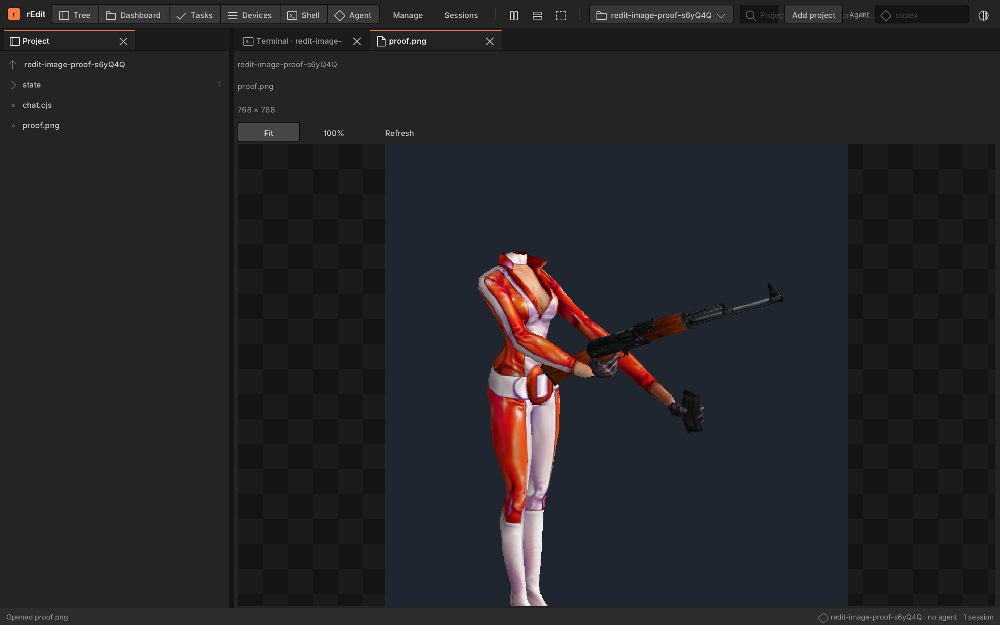

# Native chat file links and image views — macOS, 2026-09-09

Implements the owner-directed native slice of F37 in [spec 113](../../specs/113-chat-file-image-tabs.md).
The broader F37 desktop/Windows prerequisites remain open; its accepted criteria are unchanged.

Cmd-click on macOS or Ctrl-click on Windows/Linux opens a visible file reference
in an editor tab. Plain paths, displayed Markdown labels/targets, local file URLs,
and source locations use the clicked terminal's original project root. An existing
buffer is reused. Hover shows a system hand cursor and the target in the status bar; both halves
of the opening click are kept out of negotiated terminal mouse reporting.

PNG/APNG, JPEG and GIF open in a read-only image view with dimensions, Fit, 100%,
Refresh, a transparency background and wheel panning at actual size. Animated
formats show their first frame. The decoder is `stb_image.h` from the existing
stb pin `2c980bb59875b0d32144a71867fbdebb2f77cd20`, SHA-256
`594c2fe35d49488b4382dbfaec8f98366defca819d916ac95becf3e75f4200b3`.
Existing authenticated file/image routes enforce the project filesystem boundary;
the decoder repeats the 8 MiB / 8192-per-axis / 16-megapixel resource bounds.



This is a real native desktop screenshot, converted losslessly from its BMP capture
to PNG. The acceptance fixture copies the owner's 768×768
`pv_assembly_Reload_external.png` to an isolated project's `proof.png`, prints its
absolute path in a retained terminal, opens it with an actual modified pointer
click, and captures the resulting tab. It does not call the file-opening handler
directly or launch a game. The screenshot was visually inspected.

## Regression evidence

| Check | Observed result |
| --- | --- |
| Before implementation: image acceptance | Fails on missing native width; the existing pane is raw hex. |
| Before implementation: pointer acceptance | Fails because clicking the displayed Markdown label creates no file tab. |
| Remove production file-opening dispatch | Pointer acceptance fails on the missing tab. |
| Remove production texture drawing | Image acceptance fails with zero expected image pixels in the actual pane's snapshot region. |
| Bypass relative traversal refusal | Native path test fails on an escaping reference. |
| Restore each sabotage | Source byte-compared to its backup; affected object removed and rebuilt. |
| Two project roots, identical filenames | Exact red/blue fixture pixels remain distinct through root changes, tab movement, refresh and desktop restart. |
| Image controls and errors | Fit and 100% produce different pixel areas; bad refresh clears the image, exposes an error and recovers on retry. Source files are never written by the editor. |
| Retained agent | Markdown, source location and scrollback clicks preserve its PID and send no opening mouse packets. Changing the toolbar root does not change the opened file's root. |
| Decoder | PNG/JPEG/GIF, corrupt inputs, excessive dimensions/bytes, WebP refusal and failure-state clearing pass native checks. |

Baseline: native build, 8 CTest checks and 223 service tests passed. Final native
unit checks: 10/10; service suite: 223/223. The focused run with the supplied NOLF
PNG passes all three acceptance cases. Full native desktop acceptance is **67/68**,
with no skips: only the renderer's OpenGL resident-memory budget fails. Pixels,
frame-time ceilings and Vulkan validation pass. An unchanged-revision build fails
the same check, establishing KI-071 independently of the new viewer.

| Renderer run | OpenGL minus SDL RSS | Allowed | Report |
| --- | ---: | ---: | --- |
| Current, full suite | 35,776 KiB | 32,768 KiB | [Report](render-current-full.json) |
| Current, isolated retry | 33,712 KiB | 32,768 KiB | [Report](render-current-isolated.json) |
| Unchanged `85d49a9`, isolated | 34,000 KiB | 32,768 KiB | [Report](render-original-85d49a9.json) |

The original source was exported with `git archive 85d49a9` into `/tmp/redit-original`,
built in Release with the same compiler and pinned dependencies, and 183 source
files were byte-compared to that revision. The unchanged `native-render.spec.mjs`
then ran with `RENGINE_NATIVE_BINARY=/tmp/redit-original/build/bin/rengine`. The
test and its budgets were not edited. This is a recorded inherited failure, not a
passing full desktop suite or a claim about the cause of its RSS usage.

Reproduce the complete native acceptance, including the optional owner image, with:

```sh
RENGINE_IMAGE_PROOF=/absolute/path/to/project/evidence.png npm run test:desktop
```

Without that variable, the optional supplied-image case is explicitly skipped; the
two self-contained image/link regressions still run. Native source-location/decoder
checks are registered with CTest. All desktop specs remain in the npm suite.

## Wrapped-link and cursor correction — 2026-09-09

The [owner screenshot](wrap-report.png) demonstrated a missed case in the first
implementation: Codex wraps a displayed parenthesized target before the terminal
edge, leaving padding after `pv-` and indentation before `hands-viewer.png`.
The new acceptance failed on the exact truncated path at `a31f234`. The cursor
check also failed before implementation, and the native path unit test failed
on the same two-line target.

Delimited path/Markdown spans now remove presentation newlines and their padding;
independent plain references on separate lines stay separate. Both halves of the
owner's path open the full PNG. Native checks cover resize, scrollback, full-width
terminal wrapping, and reuse of the single existing image tab.

Hover now selects the real SDL system hand cursor without a modifier. Cmd/Ctrl is
still required to open. The test compares `SDL_GetCursor()` with the actual allocated
hand cursor, and covers both lines, plain text, root-invalid paths, focus loss,
menus and replacement text arriving without mouse movement. A native screenshot
shows the [two-line fixture and complete status hint](wrapped-link-hover.png);
the system cursor is outside SDL's framebuffer, so that PNG is not cursor evidence.

Two deliberate sabotages were tested and restored: stop parsing a delimited span
at its newline (fails on the truncated path), and keep SDL's default cursor even
when a link is detected (fails the real-cursor assertion). Production bytes were
restored exactly, the affected object removed, and the native build rerun. Four
sidecars were reviewed, re-anchored and officially stamped clean.

Final CTest: **10/10** (2.76 s). Final service: **223/223** (19.42 s). The baseline
service launcher test timed out once; its isolated retry passed **2/2**, followed
by the green final suite. The final desktop run passes **69/69**, zero skips,
**226.62 s**: [test output](wrap-desktop.txt), [35-spec selection](wrap-desktop-specs.json).
The already reproduced KI-071 renderer memory-budget test is excluded from this
rerun; its source and renderer backends are unchanged. This selection runs the
complete npm desktop list except `native-render.spec.mjs`, with
`RENGINE_IMAGE_PROOF` set to the NOLF PV assembly PNG.

## Limits

Windows runtime evidence remains outstanding. Native WebP decoding, animated
playback and OSC-8 links whose target never appears in the terminal cells remain
KI-070. SVG stays text. Visible references are derived from the current cell grid
and nearby wrapped rows; this is not a Markdown chat renderer or a shell cwd probe.
The terminal's recorded root is deliberately stable when a shell changes directory.
