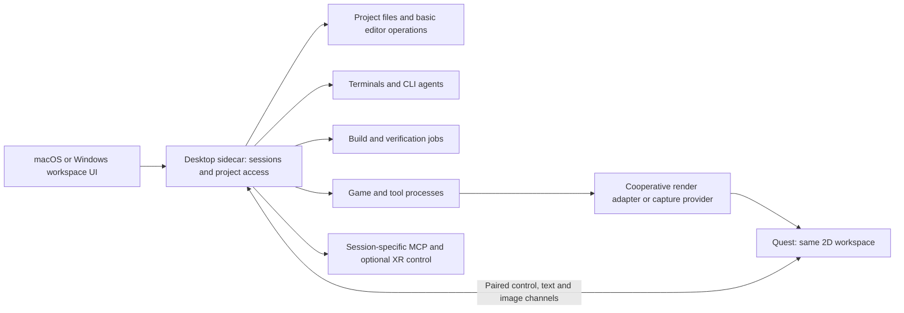

# Quest distribution and external app panes

Research date: 2026-09-05. Owner decisions: macOS and Windows from the first desktop release;
adapters first; Quest uses the shared 2D workspace before later spatial panes. The owner asked
for Quest/desktop-sidecar feasibility and is interested in unmodified app support.

**Finding:** official platform capabilities support a plausible Quest client plus desktop
sidecar. This is a documentation-backed feasibility finding. No rEngine prototype, package,
network link, input route or store submission has been tested.

## Quest delivery options

| Route | What upstream establishes | Implication for this project |
| --- | --- | --- |
| Android app in a 2D panel | Horizon OS can display Android apps as panels and offers a store route. | Candidate for a packaged client with local frontend assets and a paired desktop connection. |
| Hosted web UI / packaged PWA | Browser can run the web UI; Meta documents PWA packaging for store distribution. | Candidate for sharing a web frontend with desktop clients; HTTPS/origin/packaging constraints must be designed. |
| Spatial SDK | Android UI can be placed in spatial panels; samples cover shared 2D/immersive UI. | Suitable to investigate for the later independently placed pane experience. |

Meta describes the Android and web/Spatial SDK paths in its
[Quest app overview](https://developers.meta.com/horizon/discover/2d-apps-meta-spatial/) and
[platform guide](https://developers.meta.com/horizon/discover/platforms/).

PWA packaging uses a hosted manifest and a Trusted Web Activity. Its release path needs HTTPS,
package signing and Digital Asset Links; it is not simply a store package pointed at a private
desktop's HTTP address. A native Android shell with bundled assets may be preferable for a
desktop-local setup, but that choice still needs connection/input feasibility evidence.
[PWA overview](https://developers.meta.com/horizon/documentation/web/pwa-overview/),
[packaging instructions](https://developers.meta.com/horizon/documentation/web/pwa-packaging/).

Spatial SDK provides panel rendering/input and its hybrid sample shares Compose content between
2D and immersive activities. Meta's Focus showcase provides a workspace/panel reference. These
are relevant references for the later spatial branch, not a reason to build it before the agreed
2D version. [Panels](https://developers.meta.com/horizon/documentation/spatial-sdk/spatial-sdk-2dpanel/),
[hybrid sample](https://developers.meta.com/horizon/documentation/spatial-sdk/spatial-sdk-sample-hybrid/),
[official sample repository](https://github.com/meta-quest/Meta-Spatial-SDK-Samples).

## Proposed client/sidecar architecture

This architecture is our inference/recommendation. The first implementation should:

- Keep files, credentials, CLI installation, compilation and game ownership on the desktop.
- Send structured terminal/file data and layout state, reserving video/image transport for game
  and graphical tool surfaces. A full-desktop video alone does not supply independently arranged
  project/tool panes.
- Use a versioned, explicitly paired connection with project/session identity and input ownership.
- Recover a disconnected client without treating a reconnect as another process launch.
- Share session contracts across local desktop and Quest clients; select frontend reuse only
  after terminal/editor/input and render-stream feasibility on the required platforms.

The desktop sidecar here is a runtime companion process. It is unrelated to source-code
`._llm.json` maintenance metadata.

## External apps inside panes

| Platform/path | Verified capability | Limit of the current finding |
| --- | --- | --- |
| Windows native reparenting | Win32 `SetParent` can change window parentage, including cross-process cases. | Styles, UI state and DPI behavior require handling; not evidence every application's dialogs/input/render loop will behave correctly. |
| Windows capture | `Windows.Graphics.Capture` acquires frames from windows/displays for further presentation. | Must check runtime support and test capture, resizing and independent input routing. |
| macOS capture | ScreenCaptureKit provides window/application/display capture and frame/audio output. | Requires the applicable system permission; capture does not itself establish input control or native reparenting. |
| Quest desktop-app view | A client can be designed to display desktop-side captured/cooperative surfaces. | That is a remote presentation path, not execution or native embedding of a desktop application on Quest. |

Microsoft documents style and cross-process DPI caveats in
[SetParent](https://learn.microsoft.com/en-us/windows/win32/api/winuser/nf-winuser-setparent), and
separately documents [window capture](https://learn.microsoft.com/en-us/windows/apps/develop/media-authoring-processing/screen-capture).
Apple's [ScreenCaptureKit sample](https://developer.apple.com/documentation/screencapturekit/capturing-screen-content-in-macos?changes=_9)
demonstrates filtered window/application capture. The reviewed Apple sources establish a capture
path; this research has not established a supported universal cross-process reparenting mechanism.

Recommended product approach: implement game/tool adapters first, then qualify external-app
capture/control by platform and app type. Keep any Windows-specific reparenting experiment
separate. Do not label captured video an interactive embedded app until input/focus behavior is
also proven.

## Proofs required before promising support

1. On macOS and Windows, prove real terminal rendering, basic editing/Vim behavior and a live
   cooperative game surface in the candidate UI stack. Include resize, focus and tab moves.
2. Pair a Quest client to each desktop sidecar and test typed text, terminal control sequences,
   pointer/controller input, scrolling, readable text and connection recovery on a real headset.
3. Stream one desktop game to its Quest pane. Measure frame latency, decode/render cost and
   interaction accuracy against budgets agreed before the test.
4. Build and sideload a candidate Quest package; establish its origin/connection and distribution
   requirements. A local install does not establish a successful store submission.
5. For unmodified apps, test a finite app set with resize/focus/dialogs, minimize/occlusion,
   app restart and permission denial. State view-only versus interactive support explicitly.
6. Treat workspace coexistence with a native Quest immersive game as a separate OS/lifecycle
   investigation. A desktop-streamed game in a panel does not prove that use case.

No public service, installer, game launch, system permission or OpenXR runtime setting was
changed for this research. Toolkit/transport choices and numerical budgets remain open.
