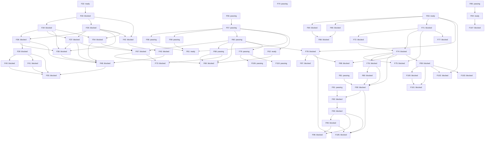

# Roadmap graph

Generated from `features.json`; review status: **approved**.

Local readiness does not satisfy external prerequisites or host-workspace authority.

| ID | Milestone | Owner | State | Description |
| --- | --- | --- | --- | --- |
| F32 | O0 | rengine | ready | Specify the first desktop workspace, terminal, draft recovery and NOLF integration slice. |
| F33 | O0 | rengine | blocked | Qualify the desktop UI, terminal and game-surface stack on macOS and Windows. |
| F34 | O1 | rengine | blocked | Implement the empty workspace with recursive splits and movable tab groups. |
| F35 | O1 | rengine | blocked | Implement a desktop sidecar that owns interactive sessions independently of views. |
| F36 | O1 | rengine | blocked | Connect real terminal panes to sidecar-owned PTY sessions. |
| F37 | O1 | rengine | blocked | Provide project tree, previews and basic text editing with optional Vim mode. |
| F38 | O1 | rengine | blocked | Persist layout and recover views onto retained sessions after GUI restart. |
| F39 | O2 | rengine | blocked | Implement the terminal-based Bash agent selector and extensible launch registry. |
| F40 | O2 | rengine | blocked | Add visible selected-agent installation and recoverable setup recipes. |
| F41 | O2 | rengine | blocked | Bootstrap project MCP integrations through agent-specific configuration adapters. |
| F42 | O3 | rengine | blocked | Implement the cooperative game surface and input contract for desktop panes. |
| F43 | O3 | nolf-improved | blocked | Render flat NOLF into an orchestrator tab on macOS and Windows. |
| F48 | O5 | rengine | blocked | Complete the first desktop workflow with a terminal, editor, session browser and flat game tab. |
| F54 | O1 | rengine | blocked | Provide the session browser for inspecting, reattaching and explicitly stopping sessions. |
| F55 | O6 | rengine | blocked | Launch the NOLF orchestrator with live game, project tree, editor and preferred agent CLI onboarding. |
| F56 | R0 | rengine | passing | Define the backend-neutral draw list and the SDL_Renderer reference adapter for the desktop. |
| F57 | R0 | rengine | passing | Implement the OpenGL adapter on macOS behind the draw list. |
| F58 | R1 | rengine | passing | Implement the Metal adapter on macOS behind the draw list. |
| F59 | R1 | rengine | passing | Implement the Vulkan adapter on Windows, extending to other platforms when they are targeted. |
| F60 | R2 | rengine | passing | Implement the Claude Design foundations on the GPU renderer: theme generation, the owned control layer, toolbar, tab strip and status bar. |
| F61 | R3 | rengine | ready | Make the renderer a curated capability with one game adopting it through an adapter. |
| F62 | R1 | rengine | ready | Verify the OpenGL adapter on Windows behind the draw list. |
| F63 | O1 | rengine | ready | Register project file formats through a versioned declaration and run their bounded preview commands. |
| F64 | O1 | rengine | blocked | Open registered formats in the native editor with raw hex and preview modes. |
| F65 | O1 | rengine | blocked | Declare a project dashboard (contract 2) and serve its actions, availability and captures. |
| F66 | O1 | rengine | blocked | Render the project dashboard as a native tab with runnable actions. |
| F67 | R2 | rengine | blocked | Implement the Claude Design update for the tree, editor, terminal and session browser. |
| F68 | R2 | rengine | passing | Implement the Claude Design menus, the settings popover and theme files. |
| F69 | R2 | rengine | blocked | Record Windows card evidence for the Claude Design update. |
| F70 | O1 | rengine | passing | Store the project integration recipe as a runbook, a scaffolding wizard, copied templates and a test. |
| F71 | O1 | rengine | blocked | Declare a project's games in .rengine/project.json (contract 3, games array) and launch any of them from the dashboard, the launcher and generic agent tools. |
| F72 | O1 | rengine | blocked | Launch a declared game from the project dashboard through an action kind game, and remove the toolbar game control. |
| F73 | R2 | rengine | blocked | Let the project explorer expand directories in place, chosen by setting, with a bounded loaded-row cap. |
| F74 | O1 | rengine | blocked | Serve the declaration-backed game preflight from the replaceable workspace worker, so a routine layered update delivers the per-project game capability. |
| F75 | O1 | rengine | blocked | Record a live game pane: a rolling buffer by default, a toggle on the game tab that commits a segment from the ring or from an explicit start/stop, and committed segments queryable over MCP as timestamped keyframes, a log slice and a manifest on one clock. |
| F76 | O1 | rengine | blocked | Contract 4 devices: a project declares where each target runs, rEngine probes reachability under the declared-command boundary and reports availability in those terms, replacing the tools-on-PATH proxy and the local executable stat for non-local targets. |
| F77 | O1 | rengine | blocked | A third game surface, cooperative: rEngine reserves the surface and passes RENGINE_SURFACE_PORT/RENGINE_SURFACE_TOKEN exactly as embedded does but injects nothing, so a game whose own engine speaks the surface protocol -- a statically linked or non-SDL2 runtime the adapter can never interpose -- gets a live workspace pane instead of falling back to its own window. |
| F78 | O1 | rengine | blocked | Add a task-tracking view with a declared backend: the local git inventory by default, GitHub Issues or Linear where a project declares one. |
| F79 | O1 | rengine | passing | Let a project name the workspace: a declared display title and glyph logo in the chrome and the window title, with rEdit as the default. |
| F80 | O1 | rengine | blocked | Actionable Devices tab: each device's bound dashboard actions render as controls that run from there through the dashboard's own route, carrying the availability dashboardActions already computed, and each bound game reports the preflight the launch uses -- replacing the inert comma-separated list of target ids. |
| F81 | O1 | rengine | passing | Open projects with externally stored rEdit capabilities and a home-directory launcher, without adding integration files to their checkout. |
| F85 | O1 | rengine | passing | A headless start: run the sidecar alone, with no desktop build, no desktop spawn and no agent, so an instance can be installed on a machine that has no C toolchain and be reached over the caller's own tunnel. |
| F90 | O1 | rengine | blocked | The project token: the instance issues one token per project root; any bound agent can contest it and, absent a rejection by the holder or the person at the desktop within the window, the token transfers to the contester at the deadline; the holder alone may launch, stop, run scripts, capture, reload or replace layers over MCP, refused by name otherwise; every bound agent can watch a filtered lifecycle feed -- token transitions, game sessions, device-bound actions, captures, layer updates -- as a resumable WebSocket its monitor reads; each agent launch gets its own identity and an agent started outside the workspace binds by discovery; all of it ships through the replaceable layers with the session host untouched. |
| F91 | O1 | rengine | passing | The surface owns its colour declaration: shellEnvironment sets TERM and COLORTERM, so a NO_COLOR inherited from whatever launched the workspace is dropped instead of being forwarded into every pane the session host will ever spawn, while an explicit override still suppresses colour. |
| F92 | O1 | rengine | blocked | Agent panes carry the conversation they hold: rEngine names one at launch for a CLI that accepts being told, records it on the session and reports it in workspace_info, and restart_agent replaces the pane's process on that same conversation with a freshly composed environment, leaving the retained session host and every other pane untouched. |
| F93 | O1 | rengine | blocked | Conversations outlive the session host that recorded them: the workspace persists them per project root, bounded and most recent first, and an agent pane offers the project's own conversations so resuming one is a choice in the pane rather than a command the person has to remember. |
| F94 | O1 | rengine | ready | A workspace's retained session host can be replaced on purpose: the launcher's --replace-host finds the host through its own descriptor and the process table (never pgrep), stops its update supervisor and then the host gracefully then forcefully, confirms the port is released, starts a fresh host from the current checkout, and reports what it stopped and started; it refuses by name a PID that serves another state directory or a launcher running inside the workspace it would replace, and a normal start says when the host is older than the code. |
| F95 | O1 | rengine | blocked | The native Sessions tab is the place a person resumes or attaches agent work: it lists the bound project's agent conversations, offering Attach for one a live pane holds and Resume for one no pane holds, so getting back into a conversation is a choice in the desktop rather than a /resume typed by hand; a live agent that names its own conversations is attach-only and marked not resumable, and the two are deduplicated so a conversation a pane holds is never also offered for resume. |
| F96 | O1 | rengine | blocked | Recover conversations the workspace never recorded: read the agent CLI's own session storage for the bound project and offer those alongside the ones rEngine minted, so a conversation started outside a pane, or one from before the workspace tracked it, is never lost. |
| F97 | O1 | rengine | blocked | A Linear tracker narrows to a person and to the states that mean active: the tracker block gains optional assignee and states keys, so a workspace opens on its owner's own in-progress work instead of on every row the team holds; both keys absent behaves exactly as before, and either key under the local or GitHub backend is refused by name rather than quietly ignored. |
| F98 | O1 | rengine | blocked | New server capabilities reach a running workspace and its attached MCP agent sessions without restarting the session host: a route that needs no PTY, surface or store state is served by the replaceable workspace worker (the tracker routes are the proof, with the host’s state directory taken from its own /api/state or found in the process table by the descriptor’s instance), the MCP facade refreshes its tool worker when the connector generation changes without waiting for a request and announces tools/list_changed, a call naming a tool the workspace no longer has is answered with the current names and the way back, and list_tasks exposes the tracker to agents. |
| F99 | O1 | rengine | blocked | rEdit is a Claude Code IDE: the workspace publishes the lock file the CLI reads, serves MCP over the WebSocket it names, and pushes the editor's selection, so an agent pane running in the workspace can connect to the editor it is running inside rather than to nothing. |
| F100 | O1 | rengine | blocked | The editor tells the agent what the person is looking at: the focused editor pane reports its file and selected range to the workspace, which pushes selection_changed to every connected CLI, and an explicit send-to-Claude gesture in the pane sends at_mentioned, so an agent in a pane can act on the selection instead of being told about it. |
| F101 | O1 | rengine | blocked | Claude's edits are reviewed in the editor rather than in the terminal: the workspace serves openDiff, close_tab and closeAllDiffTabs, and a diff opens as a tab in rEdit whose accept or reject is the answer the CLI is waiting on. |
| F102 | O1 | rengine | blocked | rEdit speaks the Language Server Protocol: a project declares its language servers, the workspace worker runs them and keeps their documents in sync with the editor's buffers, and their diagnostics reach both the editor pane and getDiagnostics — so an agent asks the editor what is broken and gets the same answer the person is looking at. |
| F103 | O1 | rengine | blocked | An agent pane is connected to the editor it runs inside without anyone typing /ide: the workspace launches a supported CLI with its own auto-connect option when exactly one rEdit is published for that root. |
| F105 | O1 | rengine | blocked | Task-driven agents (spec 103): the project token serialises workspace-mediated writes to project state -- task_add/task_update/task_decompose run the project's declared write command for the holder only, one at a time; the Sessions tab marks the holder and revokes or frees the token beside it; the Tasks pane spawns a chosen agent and model on a task (a conversation that records the task) or decomposes it into subtasks through an agent brief; prompts are project files with shipped defaults; contract 6 adds tracker.write and agents. |
| F106 | O1 | rengine | passing | A project's brand mark and wordmark are its own artwork: the chrome rasterises declared SVG in place of the letter chip and the title text, and falls back to the glyph when a declaration names a file it cannot read. |
| F107 | O1 | rengine | blocked | A workspace can restart its own update supervisor without ending a session: an action in the rEdit dashboard stops the supervisor for a state directory and starts a detached one from the current checkout, so the layer that performs layered updates — and therefore cannot receive one — can be replaced from inside the workspace it serves. |
| F110 | O1 | rengine | passing | The product is Red, and its name stops being hard-coded: one declaration in orchestrator/native/theme.json is generated into theme.h for the desktop and orchestrator/runtime/product.mjs for the workspace layer, every consumer reads the generated value, and a guard fails when shipping code spells the name instead (charter D41, spec 108). |
