# Roadmap graph

Generated from `features.proposed.json`; review status: **proposed**.

Local readiness does not satisfy external prerequisites or host-workspace authority.

```mermaid
flowchart TD
  F1["F1: proposed"]
  F2["F2: proposed"]
  F1 --> F2
  F3["F3: proposed"]
  F1 --> F3
  F4["F4: proposed"]
  F2 --> F4
  F3 --> F4
  F5["F5: proposed"]
  F4 --> F5
  F6["F6: proposed"]
  F2 --> F6
  F4 --> F6
  F7["F7: proposed"]
  F2 --> F7
  F4 --> F7
  F8["F8: proposed"]
  F5 --> F8
  F6 --> F8
  F7 --> F8
  F9["F9: proposed"]
  F8 --> F9
  F10["F10: proposed"]
  F9 --> F10
  F11["F11: proposed"]
  F9 --> F11
  F12["F12: proposed"]
  F10 --> F12
  F11 --> F12
  F13["F13: proposed"]
  F31 --> F13
  F14["F14: proposed"]
  F13 --> F14
  F15["F15: proposed"]
  F14 --> F15
  F27 --> F15
  F16["F16: proposed"]
  F13 --> F16
  F17["F17: proposed"]
  F14 --> F17
  F16 --> F17
  F27 --> F17
  F18["F18: proposed"]
  F15 --> F18
  F19["F19: proposed"]
  F15 --> F19
  F18 --> F19
  F20["F20: proposed"]
  F18 --> F20
  F21["F21: proposed"]
  F18 --> F21
  F19 --> F21
  F22["F22: proposed"]
  F3 --> F22
  F16 --> F22
  F23["F23: proposed"]
  F5 --> F23
  F22 --> F23
  F24["F24: proposed"]
  F5 --> F24
  F25["F25: proposed"]
  F24 --> F25
  F26["F26: proposed"]
  F4 --> F26
  F27["F27: proposed"]
  F31 --> F27
  F28["F28: proposed"]
  F15 --> F28
  F29["F29: proposed"]
  F13 --> F29
  F21 --> F29
  F30["F30: proposed"]
  F13 --> F30
  F21 --> F30
  F31["F31: proposed"]
  F1 --> F31
  F32["F32: proposed"]
  F33["F33: proposed"]
  F32 --> F33
  F34["F34: proposed"]
  F33 --> F34
  F35["F35: proposed"]
  F33 --> F35
  F36["F36: proposed"]
  F34 --> F36
  F35 --> F36
  F37["F37: proposed"]
  F34 --> F37
  F35 --> F37
  F38["F38: proposed"]
  F34 --> F38
  F35 --> F38
  F36 --> F38
  F37 --> F38
  F39["F39: proposed"]
  F36 --> F39
  F40["F40: proposed"]
  F39 --> F40
  F41["F41: proposed"]
  F39 --> F41
  F42["F42: proposed"]
  F33 --> F42
  F35 --> F42
  F43["F43: proposed"]
  F42 --> F43
  F44["F44: proposed"]
  F42 --> F44
  F45["F45: proposed"]
  F34 --> F45
  F35 --> F45
  F46["F46: proposed"]
  F32 --> F46
  F47["F47: proposed"]
  F41 --> F47
  F46 --> F47
  F48["F48: proposed"]
  F36 --> F48
  F37 --> F48
  F38 --> F48
  F43 --> F48
  F54 --> F48
  F49["F49: proposed"]
  F32 --> F49
  F33 --> F49
  F50["F50: proposed"]
  F35 --> F50
  F49 --> F50
  F51["F51: proposed"]
  F34 --> F51
  F37 --> F51
  F50 --> F51
  F52["F52: proposed"]
  F42 --> F52
  F51 --> F52
  F53["F53: proposed"]
  F33 --> F53
  F42 --> F53
  F54["F54: proposed"]
  F34 --> F54
  F35 --> F54
```

| ID | Milestone | Owner | State | Description |
| --- | --- | --- | --- | --- |
| F1 | M0 | rengine | proposed | Specify the reviewed iklib pilot and its two-game quality and adoption criteria. |
| F2 | M3 | rengine | proposed | Specify a project adapter contract that preserves native commands and policies. |
| F3 | M3 | rengine | proposed | Specify a verification result envelope with honest non-pass states. |
| F4 | M3 | rengine | proposed | Implement one local native-command runner with bounded process lifetime. |
| F5 | M3 | rengine | proposed | Write immutable, verifiable run bundles from runner results. |
| F6 | M3 | rengine | proposed | Describe and exercise the selected reLith check through a local adapter. |
| F7 | M3 | rengine | proposed | Describe and exercise the selected reSource check through a local adapter. |
| F8 | M3 | rengine | proposed | Demonstrate the same tool on both real engine pilots. |
| F9 | M3 | rengine | proposed | Package a minimal agent-neutral harness template with local policy extension. |
| F10 | M3 | nolf-improved | proposed | Adopt a pinned rEngine tool capability in the reLith workspace. |
| F11 | M3 | vtmb-vr | proposed | Adopt a pinned rEngine tool capability in the reSource workspace. |
| F12 | M3 | rengine | proposed | Prove independent tool upgrade and rollback in both consumers. |
| F13 | M1 | rengine | proposed | Define the catalog admission and compatibility record for real components. |
| F14 | M1 | rengine | proposed | Define reproducible dependency pins and explicit developer overrides. |
| F15 | M1 | rengine | proposed | Publish a reviewed local iklib consumption recipe and two fixture proofs. |
| F16 | M1 | rengine | proposed | Resolve the infra-vr embeddable packaging boundary from both host closures. |
| F17 | M1 | rengine | proposed | Prove pinned infra-vr consumption with both host-shaped build fixtures. |
| F18 | M2 | vtmb-vr | proposed | Complete the existing reSource core IK migration from its owning workspace. |
| F19 | M2 | nolf-improved | proposed | Complete the existing reLith IK migration with NOLF parameter parity. |
| F20 | M2 | vtmb-vr | proposed | Complete the separate reSource finger IK migration. |
| F21 | M2 | rengine | proposed | Record runtime adoption evidence by engine, game and supported profile. |
| F22 | M4 | rengine | proposed | Define report-to-reproduction metadata around existing infra-vr reports. |
| F23 | M4 | rengine | proposed | Represent oracle and manual/device evidence without replacing native gates. |
| F24 | M4 | rengine | proposed | Specify an explicit eligibility-checked development evidence export. |
| F25 | M4 | vr-port-agent-training | proposed | Demonstrate the evidence bridge in the training-owned intake path. |
| F26 | M3 | rengine | proposed | Coordinate explicitly reserved workspaces and scarce test resources. |
| F27 | M1 | rengine | proposed | Map both games' library needs and qualify the selected iklib pilot scope. |
| F28 | M5 | rengine | proposed | Prove a new host can adopt a capability without either game engine. |
| F29 | M5 | rengine | proposed | Define evidence-backed powered-by records for both engine families. |
| F30 | M5 | rengine | proposed | Audit the harness and decide the next bounded roadmap from measured results. |
| F31 | M0 | rengine | proposed | Agree the library quality standard and the usable integration knowledge package. |
| F32 | O0 | rengine | proposed | Specify the first desktop workspace, terminal, draft recovery and NOLF integration slice. |
| F33 | O0 | rengine | proposed | Qualify the desktop UI, terminal and game-surface stack on macOS and Windows. |
| F34 | O1 | rengine | proposed | Implement the empty workspace with recursive splits and movable tab groups. |
| F35 | O1 | rengine | proposed | Implement a desktop sidecar that owns interactive sessions independently of views. |
| F36 | O1 | rengine | proposed | Connect real terminal panes to sidecar-owned PTY sessions. |
| F37 | O1 | rengine | proposed | Provide project tree, previews and basic text editing with optional Vim mode. |
| F38 | O1 | rengine | proposed | Persist layout and recover views onto retained sessions after GUI restart. |
| F39 | O2 | rengine | proposed | Implement the terminal-based Bash agent selector and extensible launch registry. |
| F40 | O2 | rengine | proposed | Add visible selected-agent installation and recoverable setup recipes. |
| F41 | O2 | rengine | proposed | Bootstrap project MCP integrations through agent-specific configuration adapters. |
| F42 | O3 | rengine | proposed | Implement the cooperative game surface and input contract for desktop panes. |
| F43 | O3 | nolf-improved | proposed | Render flat NOLF into an orchestrator tab on macOS and Windows. |
| F44 | O3 | vtmb-vr | proposed | Add the reSource flat-game surface through the same public session contract. |
| F45 | O3 | rengine | proposed | Host one additional rendered tool through an explicit pane provider. |
| F46 | O4 | rengine | proposed | Resolve Meta XR Operator compatibility for a selected native host profile. |
| F47 | O4 | rengine | proposed | Demonstrate optional XR inspection/control on one identified native game session. |
| F48 | O5 | rengine | proposed | Complete the first desktop workflow with a terminal, editor, session browser and flat game tab. |
| F49 | Q0 | rengine | proposed | Specify the shared 2D Quest client delivery and desktop-link proof. |
| F50 | Q1 | rengine | proposed | Expose paired remote session access for the Quest client through the desktop sidecar. |
| F51 | Q2 | rengine | proposed | Build the Quest 2D workspace client with real remote terminal and editor access. |
| F52 | Q2 | rengine | proposed | Display and interact with a desktop game in the Quest workspace pane. |
| F53 | A0 | rengine | proposed | Qualify unmodified external-app presentation on a finite Mac/Windows app set. |
| F54 | O1 | rengine | proposed | Provide the session browser for inspecting, reattaching and explicitly stopping sessions. |
