# Roadmap graph

Generated from `features.json`; review status: **approved**.

Local readiness does not satisfy external prerequisites or host-workspace authority.

```mermaid
flowchart TD
  F32["F32: ready"]
  F33["F33: blocked"]
  F32 --> F33
  F34["F34: blocked"]
  F33 --> F34
  F35["F35: blocked"]
  F33 --> F35
  F36["F36: blocked"]
  F34 --> F36
  F35 --> F36
  F37["F37: blocked"]
  F34 --> F37
  F35 --> F37
  F38["F38: blocked"]
  F34 --> F38
  F35 --> F38
  F36 --> F38
  F37 --> F38
  F39["F39: blocked"]
  F36 --> F39
  F40["F40: blocked"]
  F39 --> F40
  F41["F41: blocked"]
  F39 --> F41
  F42["F42: blocked"]
  F33 --> F42
  F35 --> F42
  F43["F43: blocked"]
  F42 --> F43
  F48["F48: blocked"]
  F36 --> F48
  F37 --> F48
  F38 --> F48
  F43 --> F48
  F54 --> F48
  F54["F54: blocked"]
  F34 --> F54
  F35 --> F54
  F55["F55: blocked"]
  F39 --> F55
  F40 --> F55
  F41 --> F55
  F48 --> F55
  F56["F56: passing"]
  F57["F57: passing"]
  F56 --> F57
  F58["F58: passing"]
  F57 --> F58
  F59["F59: passing"]
  F57 --> F59
  F60["F60: passing"]
  F57 --> F60
  F61["F61: ready"]
  F57 --> F61
  F58 --> F61
  F59 --> F61
  F62["F62: ready"]
  F57 --> F62
  F63["F63: ready"]
  F64["F64: blocked"]
  F63 --> F64
  F65["F65: blocked"]
  F63 --> F65
  F66["F66: blocked"]
  F65 --> F66
  F64 --> F66
  F67["F67: blocked"]
  F60 --> F67
  F37 --> F67
  F54 --> F67
  F68["F68: passing"]
  F60 --> F68
  F69["F69: blocked"]
  F60 --> F69
  F67 --> F69
  F68 --> F69
  F62 --> F69
  F70["F70: passing"]
  F71["F71: blocked"]
  F63 --> F71
  F72["F72: blocked"]
  F71 --> F72
  F73["F73: blocked"]
  F67 --> F73
  F68 --> F73
  F74["F74: blocked"]
  F71 --> F74
  F72 --> F74
  F75["F75: blocked"]
  F71 --> F75
  F74 --> F75
  F76["F76: blocked"]
  F74 --> F76
  F77["F77: blocked"]
  F71 --> F77
  F78["F78: blocked"]
  F63 --> F78
  F60 --> F78
  F79["F79: passing"]
  F60 --> F79
  F80["F80: blocked"]
  F76 --> F80
  F81["F81: passing"]
  F85["F85: passing"]
  F90["F90: blocked"]
  F74 --> F90
  F76 --> F90
  F80 --> F90
  F81 --> F90
  F91["F91: passing"]
  F92["F92: blocked"]
  F90 --> F92
  F91 --> F92
  F93["F93: blocked"]
  F92 --> F93
  F94["F94: ready"]
  F85 --> F94
  F95["F95: blocked"]
  F93 --> F95
  F96["F96: blocked"]
  F93 --> F96
  F95 --> F96
  F97["F97: blocked"]
  F78 --> F97
  F98["F98: blocked"]
  F74 --> F98
  F78 --> F98
  F99["F99: blocked"]
  F74 --> F99
  F100["F100: blocked"]
  F99 --> F100
  F101["F101: blocked"]
  F99 --> F101
  F100 --> F101
  F102["F102: blocked"]
  F99 --> F102
  F63 --> F102
  F103["F103: blocked"]
  F99 --> F103
  F105["F105: blocked"]
  F78 --> F105
  F90 --> F105
  F93 --> F105
  F95 --> F105
  F106["F106: passing"]
  F79 --> F106
  F107["F107: blocked"]
  F94 --> F107
  F108["F108: ready"]
  F56 --> F108
  F60 --> F108
  F109["F109: passing"]
  F106 --> F109
  F110["F110: passing"]
  F79 --> F110
  F111["F111: passing"]
  F109 --> F111
  F112["F112: passing"]
  F113["F113: passing"]
  F114["F114: ready"]
  F113 --> F114
  F115["F115: passing"]
  F116["F116: passing"]
  F115 --> F116
  F117["F117: ready"]
  F116 --> F117
  F118["F118: ready"]
  F119["F119: blocked"]
  F118 --> F119
  F120["F120: passing"]
  F59 --> F120
  F121["F121: blocked"]
  F118 --> F121
  F120 --> F121
  F123 --> F121
  F122["F122: blocked"]
  F121 --> F122
  F119 --> F122
  F123["F123: passing"]
  F120 --> F123
  F124["F124: passing"]
  F115 --> F124
  F125["F125: passing"]
  F124 --> F125
  F126["F126: host handoff"]
  F123 --> F126
  F127["F127: blocked"]
  F126 --> F127
  F128["F128: blocked"]
  F126 --> F128
  F129["F129: passing"]
  F123 --> F129
  F130["F130: passing"]
  F132 --> F130
  F131["F131: passing"]
  F132 --> F131
  F132["F132: passing"]
  F129 --> F132
  F133["F133: passing"]
  F130 --> F133
  F131 --> F133
  F134["F134: passing"]
  F135["F135: blocked"]
  F108 --> F135
  F136["F136: blocked"]
  F133 --> F136
  F135 --> F136
  F132 --> F136
  F137["F137: passing"]
  F116 --> F137
  F138["F138: passing"]
  F139["F139: passing"]
  F140["F140: passing"]
  F139 --> F140
  F141["F141: passing"]
  F140 --> F141
  F142["F142: ready"]
  F141 --> F142
  F143["F143: blocked"]
  F142 --> F143
  F144["F144: blocked"]
  F143 --> F144
  F145["F145: blocked"]
  F144 --> F145
  F146["F146: passing"]
  F139 --> F146
  F147["F147: passing"]
  F139 --> F147
  F148["F148: passing"]
  F139 --> F148
  F149["F149: passing"]
  F148 --> F149
  F150["F150: blocked"]
  F184 --> F150
  F185 --> F150
  F186 --> F150
  F151["F151: passing"]
  F147 --> F151
  F179 --> F151
  F152["F152: blocked"]
  F150 --> F152
  F151 --> F152
  F188 --> F152
  F189 --> F152
  F153["F153: blocked"]
  F152 --> F153
  F154["F154: blocked"]
  F153 --> F154
  F155["F155: blocked"]
  F152 --> F155
  F156["F156: blocked"]
  F152 --> F156
  F157["F157: blocked"]
  F152 --> F157
  F158["F158: blocked"]
  F157 --> F158
  F159["F159: blocked"]
  F158 --> F159
  F160["F160: blocked"]
  F159 --> F160
  F161["F161: blocked"]
  F160 --> F161
  F162["F162: blocked"]
  F160 --> F162
  F163["F163: blocked"]
  F159 --> F163
  F164["F164: blocked"]
  F154 --> F164
  F155 --> F164
  F156 --> F164
  F161 --> F164
  F162 --> F164
  F163 --> F164
  F165["F165: blocked"]
  F164 --> F165
  F166["F166: passing"]
  F167["F167: passing"]
  F139 --> F167
  F168["F168: passing"]
  F167 --> F168
  F169["F169: passing"]
  F139 --> F169
  F170["F170: passing"]
  F168 --> F170
  F169 --> F170
  F171["F171: passing"]
  F148 --> F171
  F172["F172: passing"]
  F171 --> F172
  F173["F173: passing"]
  F170 --> F173
  F172 --> F173
  F174["F174: passing"]
  F169 --> F174
  F175["F175: passing"]
  F174 --> F175
  F176["F176: passing"]
  F147 --> F176
  F177["F177: passing"]
  F176 --> F177
  F178["F178: passing"]
  F176 --> F178
  F177 --> F178
  F179["F179: passing"]
  F177 --> F179
  F178 --> F179
  F180["F180: passing"]
  F140 --> F180
  F181["F181: passing"]
  F182 --> F181
  F183 --> F181
  F182["F182: passing"]
  F140 --> F182
  F183["F183: passing"]
  F180 --> F183
  F182 --> F183
  F184["F184: passing"]
  F141 --> F184
  F149 --> F184
  F185["F185: passing"]
  F184 --> F185
  F186["F186: ready"]
  F185 --> F186
  F187["F187: passing"]
  F185 --> F187
  F188["F188: passing"]
  F189["F189: blocked"]
  F188 --> F189
  F150 --> F189
  F190["F190: blocked"]
  F155 --> F190
  F191["F191: blocked"]
  F190 --> F191
  F192["F192: blocked"]
  F190 --> F192
  F193["F193: passing"]
  F106 --> F193
  F194["F194: blocked"]
  F191 --> F194
  F195["F195: blocked"]
  F194 --> F195
  F196["F196: blocked"]
  F195 --> F196
  F197["F197: blocked"]
  F195 --> F197
  F198["F198: blocked"]
  F114 --> F198
  F199["F199: blocked"]
  F114 --> F199
  F200["F200: blocked"]
  F198 --> F200
  F201["F201: ready"]
  F133 --> F201
  F224 --> F201
  F202["F202: blocked"]
  F201 --> F202
  F203["F203: blocked"]
  F201 --> F203
  F204["F204: blocked"]
  F114 --> F204
  F199 --> F204
  F202 --> F204
  F203 --> F204
  F205["F205: blocked"]
  F204 --> F205
  F206["F206: blocked"]
  F203 --> F206
  F207["F207: blocked"]
  F201 --> F207
  F202 --> F207
  F208["F208: blocked"]
  F201 --> F208
  F202 --> F208
  F209["F209: blocked"]
  F201 --> F209
  F210["F210: passing"]
  F211["F211: passing"]
  F210 --> F211
  F212["F212: ready"]
  F213["F213: passing"]
  F214["F214: passing"]
  F213 --> F214
  F215["F215: passing"]
  F213 --> F215
  F216["F216: passing"]
  F213 --> F216
  F217["F217: passing"]
  F218["F218: passing"]
  F214 --> F218
  F219["F219: passing"]
  F217 --> F219
  F220["F220: passing"]
  F217 --> F220
  F221["F221: passing"]
  F138 --> F221
  F217 --> F221
  F222["F222: ready"]
  F217 --> F222
  F221 --> F222
  F223["F223: blocked"]
  F163 --> F223
  F224["F224: passing"]
  F225["F225: blocked"]
  F201 --> F225
  F226["F226: blocked"]
  F203 --> F226
  F206 --> F226
  F225 --> F226
  F227["F227: blocked"]
  F202 --> F227
  F228["F228: ready"]
  F229["F229: blocked"]
  F228 --> F229
  F230["F230: blocked"]
  F229 --> F230
  F231["F231: blocked"]
  F229 --> F231
  F230 --> F231
```

| ID | Milestone | Owner | State | Description |
| --- | --- | --- | --- | --- |
| F32 | O0 | rengine | ready | Specify the first desktop workspace, terminal, draft recovery and NOLF integration slice. |
| F33 | O0 | rengine | blocked | Qualify the desktop UI, terminal and game-surface stack on macOS and Windows. |
| F34 | O1 | rengine | blocked | Implement the empty workspace with recursive splits and movable tab groups. |
| F35 | O1 | rengine | blocked | Implement a desktop sidecar that owns interactive sessions independently of views. |
| F36 | O1 | rengine | blocked | Connect real terminal panes to sidecar-owned PTY sessions. |
| F37 | O1 | rengine | blocked | Provide project tree, previews and basic text editing with optional Vim mode. |
| F38 | O1 | rengine | blocked | Persist layout and recover views onto retained sessions after GUI restart. |
| F39 | O2 | rengine | blocked | Implement the terminal-based Bash agent selector and extensible launch registry. |
| F40 | O2 | rengine | blocked | Add visible selected-agent installation and recoverable setup recipes. |
| F41 | O2 | rengine | blocked | Bootstrap project MCP integrations through agent-specific configuration adapters. |
| F42 | O3 | rengine | blocked | Implement the cooperative game surface and input contract for desktop panes. |
| F43 | O3 | nolf-improved | blocked | Render flat NOLF into an orchestrator tab on macOS and Windows. |
| F48 | O5 | rengine | blocked | Complete the first desktop workflow with a terminal, editor, session browser and flat game tab. |
| F54 | O1 | rengine | blocked | Provide the session browser for inspecting, reattaching and explicitly stopping sessions. |
| F55 | O6 | rengine | blocked | Launch the NOLF orchestrator with live game, project tree, editor and preferred agent CLI onboarding. |
| F56 | R0 | rengine | passing | Define the backend-neutral draw list and the SDL_Renderer reference adapter for the desktop. |
| F57 | R0 | rengine | passing | Implement the OpenGL adapter on macOS behind the draw list. |
| F58 | R1 | rengine | passing | Implement the Metal adapter on macOS behind the draw list. |
| F59 | R1 | rengine | passing | Implement the Vulkan adapter on Windows, extending to other platforms when they are targeted. |
| F60 | R2 | rengine | passing | Implement the Claude Design foundations on the GPU renderer: theme generation, the owned control layer, toolbar, tab strip and status bar. |
| F61 | R3 | rengine | ready | Make the renderer a curated capability with one game adopting it through an adapter. |
| F62 | R1 | rengine | ready | Verify the OpenGL adapter on Windows behind the draw list. |
| F63 | O1 | rengine | ready | Register project file formats through a versioned declaration and run their bounded preview commands. |
| F64 | O1 | rengine | blocked | Open registered formats in the native editor with raw hex and preview modes. |
| F65 | O1 | rengine | blocked | Declare a project dashboard (contract 2) and serve its actions, availability and captures. |
| F66 | O1 | rengine | blocked | Render the project dashboard as a native tab with runnable actions. |
| F67 | R2 | rengine | blocked | Implement the Claude Design update for the tree, editor, terminal and session browser. |
| F68 | R2 | rengine | passing | Implement the Claude Design menus, the settings popover and theme files. |
| F69 | R2 | rengine | blocked | Record Windows card evidence for the Claude Design update. |
| F70 | O1 | rengine | passing | Store the project integration recipe as a runbook, a scaffolding wizard, copied templates and a test. |
| F71 | O1 | rengine | blocked | Declare a project's games in .rengine/project.json (contract 3, games array) and launch any of them from the dashboard, the launcher and generic agent tools. |
| F72 | O1 | rengine | blocked | Launch a declared game from the project dashboard through an action kind game, and remove the toolbar game control. |
| F73 | R2 | rengine | blocked | Let the project explorer expand directories in place, chosen by setting, with a bounded loaded-row cap. |
| F74 | O1 | rengine | blocked | Serve the declaration-backed game preflight from the replaceable workspace worker, so a routine layered update delivers the per-project game capability. |
| F75 | O1 | rengine | blocked | Record a live game pane: a rolling buffer by default, a toggle on the game tab that commits a segment from the ring or from an explicit start/stop, and committed segments queryable over MCP as timestamped keyframes, a log slice and a manifest on one clock. |
| F76 | O1 | rengine | blocked | Contract 4 devices: a project declares where each target runs, rEngine probes reachability under the declared-command boundary and reports availability in those terms, replacing the tools-on-PATH proxy and the local executable stat for non-local targets. |
| F77 | O1 | rengine | blocked | A third game surface, cooperative: rEngine reserves the surface and passes RENGINE_SURFACE_PORT/RENGINE_SURFACE_TOKEN exactly as embedded does but injects nothing, so a game whose own engine speaks the surface protocol -- a statically linked or non-SDL2 runtime the adapter can never interpose -- gets a live workspace pane instead of falling back to its own window. |
| F78 | O1 | rengine | blocked | Add a task-tracking view with a declared backend: the local git inventory by default, GitHub Issues or Linear where a project declares one. |
| F79 | O1 | rengine | passing | Let a project name the workspace: a declared display title and glyph logo in the chrome and the window title, with rEdit as the default. |
| F80 | O1 | rengine | blocked | Actionable Devices tab: each device's bound dashboard actions render as controls that run from there through the dashboard's own route, carrying the availability dashboardActions already computed, and each bound game reports the preflight the launch uses -- replacing the inert comma-separated list of target ids. |
| F81 | O1 | rengine | passing | Open projects with externally stored rEdit capabilities and a home-directory launcher, without adding integration files to their checkout. |
| F85 | O1 | rengine | passing | A headless start: run the sidecar alone, with no desktop build, no desktop spawn and no agent, so an instance can be installed on a machine that has no C toolchain and be reached over the caller's own tunnel. |
| F90 | O1 | rengine | blocked | The project token: the instance issues one token per project root; any bound agent can contest it and, absent a rejection by the holder or the person at the desktop within the window, the token transfers to the contester at the deadline; the holder alone may launch, stop, run scripts, capture, reload or replace layers over MCP, refused by name otherwise; every bound agent can watch a filtered lifecycle feed -- token transitions, game sessions, device-bound actions, captures, layer updates -- as a resumable WebSocket its monitor reads; each agent launch gets its own identity and an agent started outside the workspace binds by discovery; all of it ships through the replaceable layers with the session host untouched. |
| F91 | O1 | rengine | passing | The surface owns its colour declaration: shellEnvironment sets TERM and COLORTERM, so a NO_COLOR inherited from whatever launched the workspace is dropped instead of being forwarded into every pane the session host will ever spawn, while an explicit override still suppresses colour. |
| F92 | O1 | rengine | blocked | Agent panes carry the conversation they hold: rEngine names one at launch for a CLI that accepts being told, records it on the session and reports it in workspace_info, and restart_agent replaces the pane's process on that same conversation with a freshly composed environment, leaving the retained session host and every other pane untouched. |
| F93 | O1 | rengine | blocked | Conversations outlive the session host that recorded them: the workspace persists them per project root, bounded and most recent first, and an agent pane offers the project's own conversations so resuming one is a choice in the pane rather than a command the person has to remember. |
| F94 | O1 | rengine | ready | A workspace's retained session host can be replaced on purpose: the launcher's --replace-host finds the host through its own descriptor and the process table (never pgrep), stops its update supervisor and then the host gracefully then forcefully, confirms the port is released, starts a fresh host from the current checkout, and reports what it stopped and started; it refuses by name a PID that serves another state directory or a launcher running inside the workspace it would replace, and a normal start says when the host is older than the code. |
| F95 | O1 | rengine | blocked | The native Sessions tab is the place a person resumes or attaches agent work: it lists the bound project's agent conversations, offering Attach for one a live pane holds and Resume for one no pane holds, so getting back into a conversation is a choice in the desktop rather than a /resume typed by hand; a live agent that names its own conversations is attach-only and marked not resumable, and the two are deduplicated so a conversation a pane holds is never also offered for resume. |
| F96 | O1 | rengine | blocked | Recover conversations the workspace never recorded: read the agent CLI's own session storage for the bound project and offer those alongside the ones rEngine minted, so a conversation started outside a pane, or one from before the workspace tracked it, is never lost. |
| F97 | O1 | rengine | blocked | A Linear tracker narrows to a person and to the states that mean active: the tracker block gains optional assignee and states keys, so a workspace opens on its owner's own in-progress work instead of on every row the team holds; both keys absent behaves exactly as before, and either key under the local or GitHub backend is refused by name rather than quietly ignored. |
| F98 | O1 | rengine | blocked | New server capabilities reach a running workspace and its attached MCP agent sessions without restarting the session host: a route that needs no PTY, surface or store state is served by the replaceable workspace worker (the tracker routes are the proof, with the host’s state directory taken from its own /api/state or found in the process table by the descriptor’s instance), the MCP facade refreshes its tool worker when the connector generation changes without waiting for a request and announces tools/list_changed, a call naming a tool the workspace no longer has is answered with the current names and the way back, and list_tasks exposes the tracker to agents. |
| F99 | O1 | rengine | blocked | rEdit is a Claude Code IDE: the workspace publishes the lock file the CLI reads, serves MCP over the WebSocket it names, and pushes the editor's selection, so an agent pane running in the workspace can connect to the editor it is running inside rather than to nothing. |
| F100 | O1 | rengine | blocked | The editor tells the agent what the person is looking at: the focused editor pane reports its file and selected range to the workspace, which pushes selection_changed to every connected CLI, and an explicit send-to-Claude gesture in the pane sends at_mentioned, so an agent in a pane can act on the selection instead of being told about it. |
| F101 | O1 | rengine | blocked | Claude's edits are reviewed in the editor rather than in the terminal: the workspace serves openDiff, close_tab and closeAllDiffTabs, and a diff opens as a tab in rEdit whose accept or reject is the answer the CLI is waiting on. |
| F102 | O1 | rengine | blocked | rEdit speaks the Language Server Protocol: a project declares its language servers, the workspace worker runs them and keeps their documents in sync with the editor's buffers, and their diagnostics reach both the editor pane and getDiagnostics — so an agent asks the editor what is broken and gets the same answer the person is looking at. |
| F103 | O1 | rengine | blocked | An agent pane is connected to the editor it runs inside without anyone typing /ide: the workspace launches a supported CLI with its own auto-connect option when exactly one rEdit is published for that root. |
| F105 | O1 | rengine | blocked | Task-driven agents (spec 103): the project token serialises workspace-mediated writes to project state -- task_add/task_update/task_decompose run the project's declared write command for the holder only, one at a time; the Sessions tab marks the holder and revokes or frees the token beside it; the Tasks pane spawns a chosen agent and model on a task (a conversation that records the task) or decomposes it into subtasks through an agent brief; prompts are project files with shipped defaults; contract 6 adds tracker.write and agents. |
| F106 | O1 | rengine | passing | A project's brand mark and wordmark are its own artwork: the chrome rasterises declared SVG in place of the letter chip and the title text, and falls back to the glyph when a declaration names a file it cannot read. |
| F107 | O1 | rengine | blocked | A workspace can restart its own update supervisor without ending a session: an action in the rEdit dashboard stops the supervisor for a state directory and starts a detached one from the current checkout, so the layer that performs layered updates — and therefore cannot receive one — can be replaced from inside the workspace it serves. |
| F108 | O1 | rengine | ready | An extension is an in-process native plugin (charter D38): a module built against one C header loads by absolute path, negotiates its ABI and draw-list versions, registers tabs through the owned layer and draws by appending to the frame's draw list — and a module that will not load, exports no entry point or declares an incompatible ABI is refused by name while the window keeps running. |
| F109 | O1 | rengine | passing | A pack is one pinned, versioned artifact a project declares, and its facets say how it is consumed: contract 9 adds a packs block whose library facet is source and a CMake target a game consumes at build time and whose plugin facet is a module the editor loads at run time, with "Powered by rEngine" checkable on the library facet alone. |
| F110 | O1 | rengine | passing | The product is Red, and its name stops being hard-coded: one declaration in editor/theme.json is generated into theme.h for the desktop and orchestrator/runtime/product.mjs for the workspace layer, every consumer reads the generated value, and a guard fails when shipping code spells the name instead (charter D41, spec 108). |
| F111 | O1 | rengine | passing | poweredBy leaves the pack manifest (charter D45): an adoption is recorded by the owner's sign-off in a spec, never claimed in a declaration. The key is removed from contract 9 and refused by name on either facet, with a message naming the successor rather than only saying no. D24's bar is unchanged; only the announcement is gone. This supersedes F109's criterion 5, which is left exactly as written because it records what was true when it passed. |
| F112 | O1 | rengine | passing | A paste reaches the PTY whole (KI-070): vterm calls the terminal's output callback once per character, and one socket message per character overran the 128-deep outgoing queue, so everything past roughly the first 128 characters of a paste was dropped in silence and the JSON-per-character churn made it slow as well. Bytes from one event are gathered and leave together, chunked below the session host's 2 MB frame limit and split only on UTF-8 boundaries. |
| F113 | O2 | rengine | passing | One declared agent recipe registry replaces the four private tables the launch path keeps today (NAMED and CONVERSATIONS in agents/config.mjs, FLAGS in agents/ide-connect.mjs, MODEL_FLAGS and KNOWN_AGENTS in server/tasks.mjs, and the case arms in actions/pane/posix/agent.sh): each recipe names its package, install, model flag, conversation flags, MCP overlay, hooks overlay and ACP command, and every consumer reads the one table, so adding an agent is a data edit rather than five edits that can disagree (charter D46). |
| F114 | O2 | rengine | ready | An Agent Client Protocol session kind for the agents that speak it natively (gemini, opencode, kimi acp) and for Codex through codex-acp: the workspace speaks JSON-RPC over stdio instead of owning a terminal, hands session/new the same stdio MCP server entry the per-launch mcp.json already writes, and shows the transcript with approve and deny answered through session/request_permission. Claude deliberately stays on PTY plus /ide, because its Agent SDK forbids third-party products offering subscription login (charter D46). |
| F115 | T0 | rengine | passing | A task carries the evidence that backs it: features.json rows already hold an evidence array naming the test and what it proves, and the local provider drops it on the way to the neutral row, so no surface in the workspace can answer what test backs a task. The field reaches the row beside criteria, and the Tasks tab draws each criterion with the evidence under it (charter D47). |
| F116 | T0 | rengine | passing | Contract 10 adds a tests block: a project produces a manifest keyed by the task key its provider uses, and rEngine reads it and runs nothing. Each entry names the test and how to select it, states in prose what it asserts, says which acceptance criteria it backs, gives its tier and preconditions, carries the sabotage rows that prove it bites, and records the last result with the commit and time it was taken, so a person can judge whether a test is correct and what it covers without reading it (charter D47, D44). |
| F117 | T0 | rengine | ready | A verdict on a test becomes a task in the project that owns it: a person or an agent can flag a test as bad or propose a new one from the Tasks tab, and the judgement is written through the project's own declared tracker.write command rather than asserted by rEngine. The suite files; the project owns (charter D47, preserving D44). |
| F118 | H0 | rengine | ready | An agent can drive and observe a running game through the surface transport the workspace already ships: game_input delivers a bounded script of the input packets the pane already sends, game_frame returns the current frame the server already holds, and recording_toggle and recording_commit expose the gesture the desktop already performs. Input is refused while a person holds the pane rather than evicting them, which is what the surface's own ownership rule would otherwise do (charter D48). |
| F119 | H0 | rengine | blocked | A scenario is an artifact a person can judge: a declared input script, the log facts it expects, and a checklist a human answers, producing a recording manifest and a verdict document rather than a boolean. Machine observation and human judgement stay separate and both are recorded, so a scripted run is evidence and never a substitute for a pending visual or headset criterion (charter D48). |
| F120 | R3 | rengine | passing | Extract an SDL-free GPU device layer from the Vulkan backend: instance creation taking required extensions from its caller, physical-device selection taking a caller-supplied constraint, device, queues, memory, command pools and submission, with render targets supplied from outside. The desktop drives it with a surface it made from an SDL window; an OpenXR host drives the same layer with runtime-supplied swapchain images and no surface at all. SDL stays the platform layer everywhere else (charter D49). |
| F121 | H1 | rengine | blocked | Automated Meta XR Simulator replay as a harness tier: the workspace writes a session_capture block into the Simulator's persistent_data.json, launches the game against the Simulator runtime, lets a recorded VRS capture replay deterministically, and restores the file afterwards. The block persists across launches by Meta's own design, so it is acquired and released like a lock rather than left behind, and the run carries its own budget because completion only asks the application to exit (charter D48, D49). |
| F122 | H1 | rengine | blocked | A recorded VRS capture becomes a versioned VR test fixture and a scenario variant: the script is the capture, the expected facts are log lines from the replay, and the verdict is a person's answer about what they saw, recorded the way the flat scenario already records one. Determinism is what makes the human answer meaningful across runs rather than a fresh opinion each time (charter D48). |
| F123 | R3 | rengine | passing | rEngine's first library pack from its own sources: the GPU device layer plus the resource-and-draw seam generalised from vtmb-vr's proven src/renderer/gpu/device.h, with OpenGL and Vulkan backends selected at build time, as a standalone consumable unit a project outside this repository can build and link. This is the gate a game's Vulkan work waits behind, so that one curated capability is written once here rather than twice in two game repositories (charter D50, D51, D52, D49, D24). |
| F124 | T0 | rengine | passing | A task can be read rather than scanned: the row trims its title to its column, so the title itself opens an inline detail block carrying the whole description wrapped, what the task is waiting on, its labels and assignee, and every acceptance criterion in full. The wrapping is an owned control, re_ui_paragraph, so prose anywhere in the suite can be read instead of clipped (spec 119). |
| F125 | T0 | rengine | passing | Drawing a task list costs the viewport rather than the inventory: the Tasks tab emitted layout, text measurement and draw commands for every row on every frame and microui clipped almost all of it away, so a project with 1317 tasks paid for 1317 rows to show about twenty. Only the rows the viewport can reach are emitted; each run of skipped rows becomes one spacer of exactly their height, so the scrollbar and the scroll position are unchanged (spec 120). |
| F126 | R3 | vtmb-vr | host handoff | VtMB adopts the rendering pack for the files already behind its own GPU seam, deleting src/renderer/gpu/ in favour of the pinned pack, and a Vulkan backend serves them. This is the verdict on D14c's untested bet that resource+draw granularity can carry Vulkan with command buffers, render passes and barriers built inside the backend — tested on 13 files rather than after migrating 49 more onto a seam that may not hold it (charter D52). |
| F127 | R3 | vtmb-vr | blocked | VtMB's remaining GL-touching files move behind the rendering pack, so the whole renderer talks to one seam and a backend choice reaches all of it rather than a fraction. Measured at the time of planning: 62 files touch GL and 13 were behind the seam (charter D52). |
| F128 | R3 | nolf-improved | blocked | NOLF gains the GPU seam it has never had: its GL-touching files move behind the pinned rendering pack so it can build against either backend. Measured at planning time: 102 GL symbols across 39 files, none behind any abstraction. Planned rather than committed — a local task cannot decide another project's adoption (charter D52). |
| F129 | R3 | rengine | passing | The resource-and-draw seam grows what a real renderer needs and a windowing-free backend can still provide: a render target made from colour and depth textures the host owns, a frame bracket a command-buffer backend can record into, scissor, texture sub-upload, separate alpha blending, a vec2 uniform and a depth compare function. Every addition is justified by measured call sites in two independent consumers rather than anticipated (spec 124). |
| F130 | R3 | rengine | passing | The seam's Vulkan backend: pipeline state coalesced at draw time into a cached pipeline, textures through descriptor sets, uniforms looked up by name through SPIR-V reflection into a push-constant block, staging uploads, and dynamic rendering into targets supplied from outside. This is the verdict on D14c's bet that resource+draw granularity can carry Vulkan with command buffers and render passes built inside the backend — reached in rEngine, on the scene example, before a game adopts (charter D52, spec 124). |
| F131 | R3 | rengine | passing | The seam's Metal backend, so the pack serves the third graphics API rEngine's desktop already ships and charter D29 already orders. Shaders reach it as MSL from the same glslang and SPIRV-Cross pipeline that feeds the other two, so one authored source still serves every backend (owner, 2026-09-11; spec 124). |
| F132 | R3 | rengine | passing | A scene example inside the pack that renders through the seam: a procedural scene committed as code that every gate renders, and an optional real model a person can point it at. It is the consumer whose call sites shape the render-target API and whose pixels judge the backends, and building it is also the outside-consumer proof that the pack stands alone (spec 124). |
| F133 | R3 | rengine | passing | rEngine's own 2D draw list renders through the seam, making the pack load-bearing in shipped code rather than only in an example, and SDL_Renderer stops being a shipping path as charter D49 already decided. Because SDL is the only backend that shares no code with the others, its frames are captured first and committed as the reference the comparison judges against, so retiring the path does not retire the independent witness (owner, 2026-09-11; spec 124). |
| F134 | R3 | rengine | passing | A view that is closed gives its slot back. Closing a view keeps its tab so reopening restores it, which is the refresh gesture spec 080 describes, but a window has 64 slots and nothing ever reclaimed one: after 64 distinct views a long-lived window could open nothing at all, and the only symptom was a status line. When every slot is taken the window releases the least recently used CLOSED view and names it, the way the explorer already releases the least recently opened folder at its row cap. |
| F135 | R3 | rengine | blocked | The plugin ABI widens by exactly two things, so a plugin can render and be pointed at without holding anything the renderer owns (charter D55, spec 126): a render target requested by size each frame and valid only for that frame, drawn into the tab through the TEXTURE command the game view already uses; and pointer position, buttons and wheel while the pointer is inside the plugin's own tab. Everything D38 refuses stays refused. |
| F136 | R3 | rengine | blocked | The scene renders in a tab, on the device the window already has, through the seam the desktop itself renders with — not streamed from another process as a game surface is. An .obj in the explorer opens a Scene tab the way a .png opens the image view, and a command opens the built-in procedural scene. It is still by default: one frame on open, frames while dragging, continuous only when explicitly played (charter D55, spec 126). |
| F137 | R3 | rengine | passing | A test's artifacts are where its task is. Contract 10's last block gains an artifacts array of root-relative paths with an optional label each, and the Tasks tab draws them beside the result F116 already shows, opening each in the view rEngine already has for it. rEngine still runs nothing and still opens nothing it was not given (spec 126). |
| F138 | O2 | rengine | passing | Kimi Code is a named agent with the same pane functionality as the other four CLIs, because the owner directed unified integration — the same for everyone, including session listing+discovery. A kimi pane is detected, installed and updated through agent.sh; its launch wires the workspace MCP through the project-level .kimi-code/mcp.json (the only per-project channel kimi publishes), owning exactly one namespaced key and preserving every foreign entry; its session identity comes from its own --session flags with kimi --session <id> as the resume line and an honest unknown for -c or the selector; and live session reporting arrives through a SessionStart hook installed only by an explicit, reversible guided dashboard action, never by a silent write to the person's global config (owner, 2026-09-11; spec 127). F113 stays the follow-up that collapses the per-consumer tables into one registry. |
| F139 | N0 | rengine | passing | The Rust toolchain and the red/ cargo workspace become first-class citizens of the build: rust-toolchain.toml pins the toolchain, a pinned Corrosion inside cmkr drives cargo from the same CMake entry point that builds the desktop, and init.sh checks the toolchain and instructs rather than downloading anything. This reverses spec 114's recorded 'a Rust toolchain we do not have' (owner, 2026-09-11; spec 128, D57). |
| F140 | N0 | rengine | passing | red-core holds the protobuf contract v1 for everything the façade and companion need first — sessions, tasks, the F113 agent registry and conversations, token contests, dashboard actions, feed events — and a contract-test harness validates every translated shape against the live session host, so JSON-to-proto drift fails a test instead of a phone. The owner chose schema-first over the JSON-mirror recommendation; this harness is the control that makes the second contract safe (owner, 2026-09-11; spec 128, decision 5). |
| F141 | N0 | rengine | passing | red-link attaches to a live session host over the same internal HTTP/WS surface the worker and MCP connector use, and serves the F140 contract over libp2p streams — with loopback evidence that forces the relay path, so the NAT code runs before any phone exists (owner, 2026-09-11; spec 128, decisions 2 and 4). |
| F142 | N0 | rengine | ready | Remote trust lands: static Ed25519 peer identities, a dashboard action whose QR carries the desktop peer ID, relay multiaddr and a one-time PIN, the PIN proven over Noise, allowed-phone rows persisted in the workspace state directory, and revocation by deleting a row — the Syncthing model, satisfying the pairing/revocation/root-scoping criteria F50 already records (owner, 2026-09-11; spec 128, decision 6). |
| F143 | N0 | rengine | blocked | Reachability from anywhere: red-link --relay on owner-controlled infrastructure, dcutr direct upgrade, mDNS on LAN, and one real cellular run as evidence — never the public bootstrap network, because an admin channel does not ride untrusted third parties (owner, 2026-09-11; spec 128, decision 4). |
| F144 | N0 | rengine | blocked | apps/companion exists as an Android skeleton: pinned Gradle wrapper and NDK, externalNativeBuild pointing at this repository's CMake so the app compiles the same C UI modules the desktop compiles, a Kotlin shell, and an ANativeWindow Vulkan surface through the D49 device layer — C drives the frame loop, red-core serves it through the C ABI (owner, 2026-09-11; spec 128, decisions 7 and 8). |
| F145 | N0 | rengine | blocked | Companion v0.1 — see, chat, approve: from a phone on cellular, the roots/sessions view of the F113 registry, agent conversation read and send input, token contests and permission approvals, and dashboard actions with their confirm prompts. No terminal emulator and no game frames yet; the phone acts with desktop-class power only through the same project-token semantics (owner, 2026-09-11; spec 128, decision 9). |
| F146 | J0 | rengine | passing | tools/design.py learns a Rust target: the product name and theme tokens are generated into a Rust source beside the .mjs and .h outputs, so no Rust code ever hand-writes what D41 made a data edit. The slice that unblocks every other J0 row's need for generated constants (owner, 2026-09-11; spec 129, D57). |
| F147 | J0 | rengine | passing | red-store replaces server/store.mjs and server/schema.mjs: project and session persistence in Rust with the on-disk format byte-compatible, deleted in the same commit the replacement passes (owner, 2026-09-11; spec 129, D57). |
| F148 | J0 | rengine | passing | The F113 agent recipe registry becomes declarative data: one TOML document that the remaining JS and the new Rust side both parse, with spawn-environment composition (the RENGINE_AGENT_* context) ported (owner, 2026-09-11; spec 129, D57). |
| F149 | J0 | rengine | passing | red-agents replaces agents/registry.mjs, agents/config.mjs, agents/report-session.mjs and agents/bind.mjs: conversation discovery for all five CLIs, hook overlays, and the codex trust-hash math, with agent.sh keeping its CLI surface while dispatching to the Rust binary (owner, 2026-09-11; spec 129, D57). |
| F150 | J0 | rengine | blocked | red-mcp replaces agents/mcp-worker.mjs and the runtime/tools.mjs probe: the root-bound MCP server in Rust over stdio, serving the same tool surface from the façade/host API, with the native desktop taught to exec red-mcp instead of node. This is the connection every agent pane uses, so the consumer-path evidence is live panes, not only fixtures (owner, 2026-09-11; spec 129, D57). |
| F151 | J0 | rengine | passing | red-pty replaces server/sessions.mjs: retained PTY sessions in Rust on portable-pty, with spawn, attach, scrollback replay, resize and kill identical to the JS session host, and retention across host restart as specs 059/060 promise (owner, 2026-09-11; spec 129, D57). |
| F152 | J0 | rengine | blocked | red-host I: the Rust host core replaces server/main.mjs, server/desktops.mjs and server/surfaces.mjs with surface-protocol.mjs — the native desktop connects with zero native changes, and the surfaces focus-eviction semantic (surfaces.mjs:72-76, spec 114 finding 2) is preserved verbatim (owner, 2026-09-11; spec 129, D57). |
| F153 | J0 | rengine | blocked | red-host II: server/tasks.mjs and the local half of server/tracker.mjs become Rust — the local backend's rows, readiness and criteria rendering, plus token-serialized tracker writes. tracker.mjs re-implements the features.py readiness rule while its schema text wrongly claims a shell-out (spec 114 finding 1): port the real behavior and correct the text (owner, 2026-09-11; spec 129, D57). |
| F154 | J0 | rengine | blocked | red-host III: the remote tracker providers move to Rust — GitHub and Linear read-only with the 30-second cache, refresh bypass, and the denied/unavailable/invalid taxonomy rendered exactly as today (owner, 2026-09-11; spec 129, D57). |
| F155 | J0 | rengine | blocked | red-host IV: dashboard, devices and games move to Rust — dashboard-rules availability composition, device probes and reachability caching, game preflight and launch gating (owner, 2026-09-11; spec 129, D57). |
| F156 | J0 | rengine | blocked | red-host V: formats, images and recordings move to Rust — sanitized preview subtrees with the 32k budget and paging, image dimension sniffing without the image-dimensions npm package, and recording manifest/keyframe/log reads (owner, 2026-09-11; spec 129, D57). |
| F157 | J0 | rengine | blocked | red-feed and red-token replace runtime/feed.mjs and runtime/token.mjs: the lifecycle feed ring with cursors and the project-token protocol — contest windows, segment frames, relayed pushes, retirement — with frames byte-identical to the pinned flat shapes the desktop expects (owner, 2026-09-11; spec 129, D57). |
| F158 | J0 | rengine | blocked | red-worker replaces runtime/worker.mjs (736 lines): the root-bound worker in Rust — MCP route forwarding, token/recording frame forwarding, and the layered workspace updates of spec 065 with completion kept distinct from acceptance (owner, 2026-09-11; spec 129, D57). |
| F159 | J0 | rengine | blocked | red-supervisor and the launchers replace runtime/supervisor.mjs and launcher/headless.mjs, replace.mjs, restart-supervisor.mjs and sidecar.mjs — including restart-supervisor's confirm prompt with no non-interactive bypass and its read-only --plan mode, which AGENTS.md's hand-back rule names (owner, 2026-09-11; spec 129, D57). |
| F160 | J0 | rengine | blocked | red-client replaces runtime/client.mjs and runtime/discovery.mjs: the routine-update CLI and runtime discovery with spec 101's distrust rules (state dir from /api/state, process-table fallback, never the URL as key, never the first host row on trust) (owner, 2026-09-11; spec 129, D57). |
| F161 | J0 | rengine | blocked | red-ide replaces runtime/ide.mjs and runtime/lsp.mjs: editor discovery and lock reading honoring CLAUDE_CONFIG_DIR (the F113 repair) and the editor-as-IDE evidence doc's distrust rules, plus the editor surface's LSP wiring (owner, 2026-09-11; spec 129, D57). |
| F162 | J0 | rengine | blocked | red-util replaces runtime/scripts.mjs, runtime/windows.mjs, runtime/desktop.mjs, runtime/bootstrap.mjs and orchestrator/external-project.mjs: script tabs with their retain/show semantics (spec 071), project-window lifecycle (spec 069), bootstrap helpers, and external capability declarations (spec 085) (owner, 2026-09-11; spec 129, D57). |
| F163 | J0 | rengine | blocked | Entry points move off Node: orchestrator/build.mjs, launch.mjs and prepare.mjs are replaced by cmake/cargo entry points, the RENGINE_NODE_EXECUTABLE coupling and build.lock dance are gone, package.json shrinks to metadata or disappears, and node_modules leaves the boot path (owner, 2026-09-11; spec 129, D57). |
| F164 | J0 | rengine | blocked | The JS test suite sunsets: every row of tests/suite-coverage.test.mjs has a named Rust-side or native-side equivalent or a recorded reason, the suite-coverage mechanism itself is ported so no fixture silently leaves the report, and node --test exits every gate (owner, 2026-09-11; spec 129, D57). |
| F165 | J0 | rengine | blocked | Epic close: one full dogfood day on the Rust-only stack — panes of every CLI, terminals, updates, recordings, dashboard actions, this MCP — with the evidence logged, AGENTS.md's D57 bullet rewritten past tense, and node gone from the runtime (owner, 2026-09-11; spec 129, D57). |
| F166 | J0 | rengine | passing | Where a document opens and what a dragged tab shows: a file chosen in a browser view opens in the most recently used other pane (the same pane when there is only one), each view keeps its own scroll position within a pane, and a tab being dragged is drawn under the cursor with the pane and index it would land in (owner, 2026-09-12; spec 130). |
| F167 | J0 | rengine | passing | F148a (the data half of F148): the agent recipe registry is one TOML document — agents/registry.toml is the only recipe table, parsed by the remaining JS and the red-agents crate through the same bounded subset, with the EXTRA file moving from JSON to TOML (owner, 2026-09-12; spec 129, KI-092). |
| F168 | J0 | rengine | passing | F148b (the spawn half of F148): the RENGINE_AGENT_* spawn-environment composition is ported to red-agents, pinned at the pty.spawn boundary by a stub-pty harness (owner, 2026-09-12; spec 129, KI-092). |
| F169 | J0 | rengine | passing | F147a (the crate half of F147): red-store as a Rust crate with byte-parity against the JS on-disk format on a captured fixture corpus, and schema.mjs's bounded validator as a second module with identical error strings; nothing deleted (owner, 2026-09-12; spec 129, KI-091). |
| F170 | J0 | rengine | passing | F147b (the swap half of F147): the JS host consumes red-store over the stdio service through a thin client, the ten server consumers rewired, store.mjs and schema.mjs deleted in the same commit the replacement passes (owner, 2026-09-12; spec 129, KI-091). |
| F171 | J0 | rengine | passing | F149a (the shell half of F149): the red-agents binary carries the registry's shell surface — list/show byte-exact with the registry.mjs CLI, the three conversation flag parsers, and the codex hook key/trust-hash math — and agent.sh dispatches its registry reads to it with its own CLI unchanged (owner, 2026-09-12; spec 129, KI-093). |
| F172 | J0 | rengine | passing | F149b (the hook reporter half of F149): red-agents report-session emits byte-identical payloads to the JS version for all five providers on recorded hook fixtures, the launcher composes the Rust binary into hook command lines, and report-session.mjs is deleted (owner, 2026-09-12; spec 129, KI-093). |
| F173 | J0 | rengine | passing | F149c (the consumer half of F149): the server-side recipe/config consumers move off registry.mjs and config.mjs — the tasks menu and model flags, store's conversation-id shaping, sessions' capability reads, agentLaunch's MCP overlays — and registry.mjs, config.mjs and bind.mjs are deleted (owner, 2026-09-12; spec 129, KI-093). |
| F174 | J0 | rengine | passing | F170a (the channel half of F170): the stdio red-store service (newline-delimited JSON-RPC, the house's LSP/MCP-worker shape) and the thin store-client.mjs presenting the exact WorkspaceStore surface, fail statuses included — the F169 corpus replayed through the client drift-free (owner, 2026-09-12; spec 129, KI-095). |
| F175 | J0 | rengine | passing | F170b (the swap half of F170): the ten server consumers of store.mjs/schema.mjs rewire to store-client.mjs, main.mjs manages the service lifecycle, and store.mjs and schema.mjs are deleted in the same commit the replacement passes (owner, 2026-09-12; spec 129, KI-095). |
| F176 | J0 | rengine | passing | F151a (the core half of F151): red-pty on portable-pty behind the F174 channel shape, with the JS host's exact semantics — UTF-16-unit scrollback truncation, string_decoder tail-holding, tree kill, resize guard, input cap — proven by one scripted scenario set driving both the real JS Sessions class and the service (owner, 2026-09-13; spec 129, KI-096). |
| F177 | J0 | rengine | passing | F151b (the retention half of F151): the restart-retention architecture is decided and implemented — whether red-pty stays per-host as today or becomes a long-lived per-state-dir service with a descriptor the next host discovers, with restart evidence matching specs 059/060's promises (owner, 2026-09-13; spec 129, KI-096). |
| F178 | J0 | rengine | passing | F151c (the swap half of F151): the Sessions class becomes the thin client over red-pty, sessions.mjs is deleted in the same commit the replacement passes, and terminal behaviors are byte-identical on the full suite (owner, 2026-09-13; spec 129, KI-096). |
| F179 | J0 | rengine | passing | F151d (the handover half of F151): a pane's own record travels with its PTY and a starting host adopts what the state directory's service holds, so replacing a host stops costing the owner their agent panes — carrying out charter D60, which supersedes one clause of F94's criterion 4 (owner, 2026-09-13; spec 131, KI-096). |
| F180 | N0 | rengine | passing | F141a (the read half of F141): red-link attaches to a live workspace over the internal HTTP API the worker and the MCP connector already use, and serves the v0.1 read surface as red.v1 over libp2p — through circuit-relay v2 only, because the façade opens no direct listener at all (owner, 2026-09-13; spec 128 decisions 2 and 4, KI-098). |
| F181 | N0 | rengine | passing | F141b (the feed half of F141): the workspace's event stream arrives on a long-lived libp2p stream in order with monotonic sequence, and a reconnect resumes from a cursor exactly as the host's own clients do (owner, 2026-09-13; spec 128 decision 2, KI-098). |
| F182 | N0 | rengine | passing | F181a (the contract half of F181): red.v1 carries the workspace lifecycle ring — the worker's feed of token, task, agent, game, capture, device-action and workspace frames — translated strictly, with the live ring judged by the F140 harness (owner, 2026-09-13; spec 128 decision 5, KI-099). |
| F183 | N0 | rengine | passing | F181b (the transport half of F181): the lifecycle ring arrives on a long-lived libp2p stream in order with monotonic sequence, and a reconnect resumes from a cursor exactly as the worker's /feed clients do (owner, 2026-09-13; spec 128 decision 2, KI-099). |
| F184 | J0 | rengine | passing | F150a (the surface half of F150): the MCP tool surface becomes data — captured from the live JS worker into a declaration red-mcp serves — so the port cannot drift on fifteen kilobytes of hand-transcribed description, with both servers driven by one MCP client and compared (owner, 2026-09-13; spec 129, KI-100). |
| F185 | J0 | rengine | passing | F150b (the calls half of F150): tools/call for the full root-bound surface in Rust over the façade/host API, the native desktop taught to exec red-mcp, and agents/mcp-worker.mjs and runtime/tools.mjs deleted (owner, 2026-09-13; spec 129, KI-100). |
| F186 | J0 | rengine | ready | F150c (the live-pane half of F150): a real pane of each CLI completes a task-scoped action through the Rust MCP — the consumer-path evidence this row exists for, which is a dogfooding run in the owner's workspace rather than a fixture (owner, 2026-09-13; spec 129, KI-100). |
| F187 | J0 | rengine | passing | F150b2 (the cutover half of F185): the workspace launches red-mcp instead of the node tool worker, agents/mcp-worker.mjs and runtime/tools.mjs are deleted, and the layered-update contract answers what updating a connector layer means once that layer is a compiled binary (owner, 2026-09-13; spec 129/065, KI-100). |
| F188 | J0 | rengine | passing | F152a (the door half of F152): red-host owns the port and forwards what it does not own yet to a JS backend beside it — the shape the root-bound worker already runs one layer up — so the host can be ported a route at a time rather than all at once (owner, 2026-09-13; spec 129, KI-101). |
| F189 | J0 | rengine | blocked | F152b (the cutover half of F152): the routes red-host owns move into it, the native desktop connects unchanged, the focus-eviction semantic is preserved verbatim, and server/main.mjs, desktops.mjs, surfaces.mjs and surface-protocol.mjs are deleted (owner, 2026-09-13; spec 129, KI-101). |
| F190 | O1 | rengine | blocked | A repository's git worktrees are visible as a set: red-project discovers every worktree of a root's repository with its branch, whether its tree is clean, and whether its branch is merged into its base — the survey that decides whether one may be removed (spec 134 D1/D2; charter D20). |
| F191 | O1 | rengine | blocked | Creating and removing a worktree from the workspace: the destination is the project's declared `worktrees` directory at contract 11, an undeclared project is asked and offered the declaration (charter D63), and removal is refused by name unless the worktree is clean and merged (spec 134 D1/D5/D6). |
| F192 | O1 | rengine | blocked | The Projects modal replaces the toolbar's project switcher and path field: repositories group their worktree roots, the status bar names the current project and opens the modal, and the Agent control becomes the dropdown design has specified since spec 064 (spec 134 D3/D4/D7). |
| F193 | O1 | rengine | passing | A project's declared mark is the application's tile on the operating system, not only inside the chrome: macOS draws the Dock tile from the same icon.image spec 104 resolves, rasterised, and a declaration that names only a glyph leaves the tile as the process found it. |
| F194 | O1 | rengine | blocked | A project declares where its agent memories live (contract 12, charter D65): memories.store is "repo" with a sibling path, or "workspace"; rEngine reads the block, refuses a path outside the root, and offers to write the declaration under D63 rather than editing it silently. |
| F195 | O1 | rengine | blocked | The Memories tab: what each agent holds for the selected root, read through a Rust route behind red-host (charter D57). An agent with no memory store says so rather than drawing an empty list, and the tab names which store a root uses before anything is synced. |
| F196 | O1 | rengine | blocked | Carrying memories between machines: a repo-store root writes them into its own tree where git moves them, a workspace-store root keeps them in the state directory and a second machine fetches them over red-link's facade (charter D58). Installing onto a machine is shown and confirmed and never silent (D3), and a file that differs on both sides is chosen per file (D4). |
| F197 | O1 | rengine | blocked | kimi's memories (charter D66): rEngine defines where they live and points kimi at them through its own SessionStart hook mechanism, with every other agent a reserved empty slot. Blocked on the recorded open question - whether kimi injects a SessionStart hook's stdout into context - which is answered before implementation, not guessed. |
| F198 | O1 | rengine | blocked | An ACP recipe a project declares (spec 138): the agent-recipe grammar gains an acp capability, contract 6 admits a model-less ACP entry, and kohai-acp proves it from Kohai's external declaration and registry-extra rather than from rEngine's own registry. |
| F199 | O1 | rengine | blocked | The Agent tab: one native C view of an ACP session for every ACP agent - transcript, composer, approve/deny where the agent asks permission, plan entries carrying links as buttons, tool calls in plain words, and an ended-here-continues-there state for a session the agent cannot load back. Held to D67's consumer-side standard. |
| F200 | O1 | rengine | blocked | Declared extra MCP servers offered to an ACP agent (charter D70): a project lists them, the workspace passes them at session/new beside its own and names them in the tab, and an agent that does not advertise matching capabilities has them reported as not taken rather than dropped silently. Consumption by another project's bridge is an external prerequisite, referenced and never asserted. |
| F201 | O1 | rengine | ready | re_model: the C engine library over llama_r.cpp - this project's fork of upstream llama.cpp, pinned as a submodule at third_party/ (no shared libs, no server or example binaries, Metal on macOS) - behind a C ABI: open a declared model, attach declared adapters, run one turn with a grammar, stream, cancel, report identity and counters (charter D68/D72, specs 139 and 150). |
| F202 | O1 | rengine | blocked | Models and adapters declared per machine in the workspace state directory by path and digest, with a guided action that verifies them and never downloads, shown and confirmed before it writes (D63 pattern). |
| F203 | O1 | rengine | blocked | red-model: the Rust per-state-directory service importing re_model over FFI - the first Rust-imports-C in the cargo workspace - serving open, turn and cancel, and surviving host replacement with its model loaded. |
| F204 | O1 | rengine | blocked | The local agent as an ACP agent through F114: the C turn loop with a host-supplied tool vtable, tools reached through one route on red-host with red-mcp linked as a library and the agent's identity explicit, so the project token gates the agent rather than exempting it as the person at the desktop. |
| F205 | O1 | rengine | blocked | Delegation: the local agent files a task and spawns a chosen CLI agent on it through the existing task and spawn tools, watches the feed and the task row, and reports the outcome. It never types into a pane. Policy lives in a project prompt file with a shipped default. |
| F206 | O1 | rengine | blocked | Offload: red-model on a second machine reached through that machine's red-link, with the wire contract gaining the models a peer serves. Weights never cross the link. |
| F207 | O1 | rengine | blocked | In-process: the C desktop links re_model for editor-local completion with a small declared model, measured against the desktop's recorded budgets. The agent's conversation stays host-owned. |
| F208 | O1 | rengine | blocked | Adapter consumption (charter D69): an adapter declared beside its base by digest, refused on mismatch, attached per turn. Blocked - not failing - until the training project's readiness gate is green, because no adapter may exist before it. |
| F209 | O1 | rengine | blocked | The engine as a pack candidate: a pack manifest with a library facet and a measured quality record, consumable from outside the tree. Adoption and the approved claim remain a game's sign-off (D24, D44b, D45) and are not claimed here. |
| F210 | O1 | rengine | passing | Conversation-store adapters (spec 140): one per agent CLI, answering which conversations exist for a root with an id, a modified time and a title. Read-only - the stores belong to the CLIs. Identity is the declared project and root id; a CLI's path-derived key is mapped, never adopted. |
| F211 | O1 | rengine | passing | The conversations view: the stores joined with rEngine's own session records, so a conversation the workspace has a pane for is marked and one it only knows from the CLI is listed all the same. Choosing one resumes it through the capability spec 096 already declares. |
| F212 | O1 | rengine | ready | A workspace-visible warning when the retained session host advertises fewer capabilities than the running build declares, so a feature that is off because the host is old reads as old rather than as broken (KI-116). |
| F213 | O1 | rengine | passing | The conversation-id parsers become one adapter per agent: red-agents/src/parsers.rs holds claude_flags, kimi_flags, codex_resume and kimi_id_shape in one file, which is the antipattern docs/lessons-learned.md records. Each moves to its own module exporting the same entry point, over a shared module that owns the Parsed shape and the id-shape helpers. |
| F214 | O1 | rengine | passing | Agent-specific branches in the bind and launch path move behind a declared capability. red-agents/src/bind.rs asks `if agent == "kimi"` to decide where MCP wiring goes and launch.rs inserts a kimi-named plan key; both are identity checks standing in for a capability the recipe should declare, so a fourth agent needing the same treatment means editing shared code again. |
| F215 | O1 | rengine | passing | The store stops knowing what an agent's conversation ids look like. red-store carries IdShape::KimiSession and red_store_check maps the literal "kimi" to it, so the component that persists conversations knows one CLI's id format — knowledge that belongs to that CLI's recipe. |
| F216 | O1 | rengine | passing | red-host's codex-specific branches move behind a declared capability: panes.rs refuses a resume path unless the agent is literally codex, and handoff.rs spawns with --agent codex hard-coded. Both encode a capability (which CLIs can be handed a conversation to resume) as an identity. |
| F217 | O1 | rengine | passing | A guard that fails the build when an agent's name appears in shared code — the check that would have caught F210 and every row above. The product name already has one (design.py check fails on a hand-written occurrence); an agent name has none, which is why a spec saying "one adapter per CLI" did not prevent one file holding three. |
| F218 | O1 | rengine | passing | bind's start hints for a CUSTOM agent are a per-CLI catalogue written out in shared code: red-agents/src/bind.rs prints claude's --mcp-config/--settings line, codex's -c mcp_servers line, and a sentence naming gemini, opencode and kimi. F214 declared those spellings in the registry, so the catalogue now DUPLICATES them — change a recipe's flag and bind's hint silently lies. The hints should be generated from what each recipe declares. |
| F219 | O1 | rengine | passing | Two identity DEFAULTS: red-agents/src/report.rs defaults an absent --provider to claude, from when only claude reported a session, and editor/workspace.c falls back to "codex" when no agent is chosen. Both are one CLI's name standing in for "the first one declared", and both are load-bearing — changing the reporter's default moves hooks already installed in people's CLI configuration, and changing the desktop's changes what a person gets when they press the button. tools/agent_names.py carries them as declared exceptions. |
| F220 | O1 | rengine | passing | Per-CLI knowledge that lives in shared code because it has nowhere declared to go: the CLAUDE_CODE_* identity variables a pane scrubs (spawn.rs and sessions-client.mjs, KI-113), the install directories a PATH search adds (.opencode/bin), red-ide's whole claude-shaped bridge (the lock directory, the discovery path, the x-claude-code-ide-authorization header), red-project's tasks.rs and its codexModels method, red-mcp's message and agents/mcp.mjs's explanation that two CLIs differ in how they take a changed tool list, and launch.mjs's usage line listing the five agents. Each is either a recipe key or an adapter file; tools/agent_names.py carries all of them as declared exceptions, which is the list this row works through. |
| F221 | O1 | rengine | passing | How a CLI is handed the brief a spawn carries is a declared capability rather than an assumption. A spawn appended the rendered brief to the pane's argv for every CLI, which is how two of the five take one — and a CLI that reads a bare word as a subcommand answered "unknown command '# F1765 …'" and exited 1 about two seconds after its pane opened, with the workspace reporting the session as having no conversation. `prompt.kind` declares the delivery: `argv` is the last positional argument, `paste` is typed into the pane as a bracketed paste by the service that owns its PTY, submitted only once the pane echoes the line back, and a CLI that declares neither is refused by name with nothing started — the treatment `model_args` already gives a model flag rEngine does not know. |
| F222 | O1 | rengine | ready | Saying one line to a pane that is already running is a declared capability with an owner's grant on it, rather than two curl calls and a person watching the pane. `session_message` types ONE printable line into a retained agent pane of the same project and presses Enter only once the pane echoes the line's own token back — spec 149's handshake, attached to a pane that is already up rather than to a spawn. How a CLI takes a message to a running composer is `message.kind` in its recipe, distinct from `prompt.kind`, and a CLI that declares none is refused by name with nothing typed. The project token is necessary and NOT sufficient: the token transfers to a contester on silence, so a relay also needs a separate owner grant naming one pane and bounded by a count and a deadline, written only by an interactively confirmed dashboard action. Spec 139 decision 6 and F205 are reconciled rather than amended — they scope the local model agent's delegation gesture, the tool is excluded from that loop's set by default, and its route trace still shows no input-route call. |
| F223 | J0 | rengine | blocked | Every dashboard action runs on Windows with no bash: the eight PowerShell ports in actions/win/ are EXECUTED on a Windows host and their behaviour compared to the posix originals, and the Rust side stops assuming bash — red_project::command::bash_path() and its live call sites in red-worker (dashboard run_payload, the agent menu, pipe) and red-host (panes.rs, including a terminal pane's default shell) gain a Windows arm, and actions/pane/win/agent.ps1 replaces the RENGINE_BASH wrap red-agent-launch applies on win32 (owner, 2026-09-16: "You should not use bash on windows even at transitional phases"; charter D71, spec 147). |
| F224 | O1 | rengine | passing | llama_r.cpp: this project's fork of UPSTREAM llama.cpp in its own repository, pinned as a submodule at third_party/llama_r.cpp, with a written policy for both directions of change - upstream merged on this project's schedule, and a specific ik_llama.cpp kernel or quant type cherry-picked only with a recorded reason per commit. The base is upstream rather than an existing fork because ik_llama.cpp states CPU and CUDA are its only fully supported backends and asks that Metal issues not be filed, while Metal is macOS's path and iOS's only GPU path, and it was last synced with upstream in August 2024 (charter D72, spec 150). |
| F225 | O1 | rengine | blocked | The pack's per-platform host layer: one host file per platform under packs/agent/, owning what inference needs from a platform rather than an application - process and memory ownership, the iOS increased-memory-limit entitlement, thermal backoff, and lifecycle - plus a thin harness app that runs the engine standalone on a device. apps/companion/ stays the shipped app (D58) and links the pack. Same shape as editor/render/seam_host.h: one source, one host file per platform (charter D73, spec 150 decision 4). |
| F226 | O1 | rengine | blocked | A device that cannot host a model borrows one from a device beside it: a game on a Quest whose memory is spent on rendering reaches a phone's (or a Windows PC's) inference endpoint through red-core's C ABI over red-link, discovered by mDNS on the LAN and identified by the Ed25519 pairing D58 already declares, over red.v1 gaining "the models a peer serves". No new wire contract and no new listener: the consumer links a static library and calls C, and the only thing crossing the network is Rust (charter D73, spec 150 decision 5). |
| F227 | O1 | rengine | blocked | A model declaration records WHICH QUANTIZATION a file is and the measurement behind it, not only its path and digest. Two correctly-digested files of one model can differ by fifteen points: converting a QAT checkpoint naively to Q4_0 in llama.cpp gives 24.77% byte-exactness against the BF16 QAT lattice and 70.2% top-1 where a correctly-derived UD-Q4_K_XL gives 85.6%, and for a QAT checkpoint higher-precision quants score WORSE. A digest proves a file is the one you meant and says nothing about whether it was made correctly (spec 150 decision 9, extending F202). |
| F228 | O1 | rengine | ready | red-jev: the Rust client for the Jev judgement API over the EXISTING red_core::tls::request - the same outbound HTTPS path red-project already uses to reach Linear, so no new dependency and no new category of network access. Typed primitives that encode the shape trap (choice takes a criteria MAP, score takes an ordered LIST), the key read from the state directory and never logged, the model pinned by version rather than the moving alias, retries that honour retry-after, and a recorded call log carrying the versioned model id that answered (charter D74, spec 151). |
| F229 | O1 | rengine | blocked | Three named, closed capabilities over red-jev - test-failure triage, feature-row readiness, and known-issue de-duplication - each owning its question set and a state builder that may read ONLY the sources it declares. There is deliberately no generic ask tool: a generic tool would let any agent send anything and defeat the boundary. v1 sends only content this project already writes down; source and diffs are out of scope. Confidence gates behaviour in three bands per capability, and nothing runs on a timer (charter D74, spec 151). |
| F230 | O1 | rengine | blocked | The judgement view: the desktop shows what the capabilities produced, over the channel that already exists (editor/net.c -> /api/*, the path tracker rows already travel) and with ZERO plugin ABI movement. This replaces the first draft's plugin ABI v3 data channel, which was wrong by spec 106's own rule - `size` on every struct exists so "a later ABI that only adds members can keep its number" - and whose exact-match rule would have made a bump a flag day refusing every existing plugin, for an experiment designed to be discardable. A generic host-hands-the-frame document would also have been the first host-table entry that is a data pipe rather than a capability, laundering D38's "the struct is the grant" (charter D74, specs 106 and 151). |
| F231 | O1 | rengine | blocked | The adoption decision, made on measured outcomes rather than impressions: the recorded judgements are scored against what actually happened, against a metric registered BEFORE the first call, and the decision to adopt at top level or to drop the capabilities is recorded either way. It also answers the question the experiment is really for - whether the LOCAL model (charter D68/D73) could do these classifications - because adopting a cloud judge at top level cuts across this project's committed local direction (charter D74, spec 151). |
