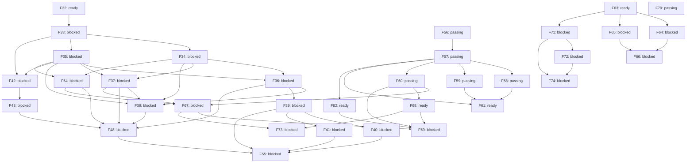

# Roadmap graph

Generated from `features.json`; review status: **approved**.

Local readiness does not satisfy external prerequisites or host-workspace authority.

| ID | Milestone | Owner | State | Description |
| --- | --- | --- | --- | --- |
| F32 | O0 | rengine | ready | Specify the first desktop workspace, terminal, draft recovery and NOLF integration slice. |
| F33 | O0 | rengine | blocked | Qualify the desktop UI, terminal and game-surface stack on macOS and Windows. |
| F34 | O1 | rengine | blocked | Implement the empty workspace with recursive splits and movable tab groups. |
| F35 | O1 | rengine | blocked | Implement a desktop sidecar that owns interactive sessions independently of views. |
| F36 | O1 | rengine | blocked | Connect real terminal panes to sidecar-owned PTY sessions. |
| F37 | O1 | rengine | blocked | Provide project tree, previews and basic text editing with optional Vim mode. |
| F38 | O1 | rengine | blocked | Persist layout and recover views onto retained sessions after GUI restart. |
| F39 | O2 | rengine | blocked | Implement the terminal-based Bash agent selector and extensible launch registry. |
| F40 | O2 | rengine | blocked | Add visible selected-agent installation and recoverable setup recipes. |
| F41 | O2 | rengine | blocked | Bootstrap project MCP integrations through agent-specific configuration adapters. |
| F42 | O3 | rengine | blocked | Implement the cooperative game surface and input contract for desktop panes. |
| F43 | O3 | nolf-improved | blocked | Render flat NOLF into an orchestrator tab on macOS and Windows. |
| F48 | O5 | rengine | blocked | Complete the first desktop workflow with a terminal, editor, session browser and flat game tab. |
| F54 | O1 | rengine | blocked | Provide the session browser for inspecting, reattaching and explicitly stopping sessions. |
| F55 | O6 | rengine | blocked | Launch the NOLF orchestrator with live game, project tree, editor and preferred agent CLI onboarding. |
| F56 | R0 | rengine | passing | Define the backend-neutral draw list and the SDL_Renderer reference adapter for the desktop. |
| F57 | R0 | rengine | passing | Implement the OpenGL adapter on macOS behind the draw list. |
| F58 | R1 | rengine | passing | Implement the Metal adapter on macOS behind the draw list. |
| F59 | R1 | rengine | passing | Implement the Vulkan adapter on Windows, extending to other platforms when they are targeted. |
| F60 | R2 | rengine | passing | Implement the Claude Design foundations on the GPU renderer: theme generation, the owned control layer, toolbar, tab strip and status bar. |
| F61 | R3 | rengine | ready | Make the renderer a curated capability with one game adopting it through an adapter. |
| F62 | R1 | rengine | ready | Verify the OpenGL adapter on Windows behind the draw list. |
| F63 | O1 | rengine | ready | Register project file formats through a versioned declaration and run their bounded preview commands. |
| F64 | O1 | rengine | blocked | Open registered formats in the native editor with raw hex and preview modes. |
| F65 | O1 | rengine | blocked | Declare a project dashboard (contract 2) and serve its actions, availability and captures. |
| F66 | O1 | rengine | blocked | Render the project dashboard as a native tab with runnable actions. |
| F67 | R2 | rengine | blocked | Implement the Claude Design update for the tree, editor, terminal and session browser. |
| F68 | R2 | rengine | ready | Implement the Claude Design menus, the settings popover and theme files. |
| F69 | R2 | rengine | blocked | Record Windows card evidence for the Claude Design update. |
| F70 | O1 | rengine | passing | Store the project integration recipe as a runbook, a scaffolding wizard, copied templates and a test. |
| F71 | O1 | rengine | blocked | Declare a project's games in .rengine/project.json (contract 3, games array) and launch any of them from the dashboard, the launcher and generic agent tools. |
| F72 | O1 | rengine | blocked | Launch a declared game from the project dashboard through an action kind game, and remove the toolbar game control. |
| F73 | R2 | rengine | blocked | Let the project explorer expand directories in place, chosen by setting, with a bounded loaded-row cap. |
| F74 | O1 | rengine | blocked | Serve the declaration-backed game preflight from the replaceable workspace worker, so a routine layered update delivers the per-project game capability. |
