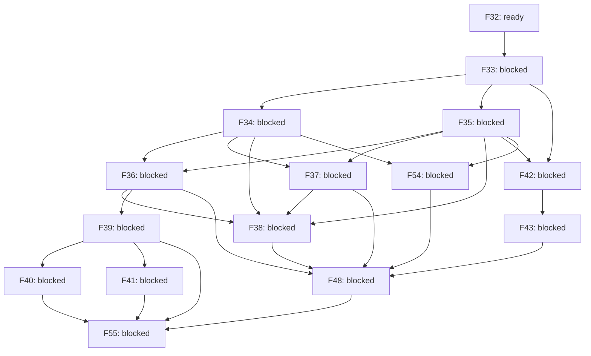

# Roadmap graph

Generated from `features.json`; review status: **approved**.

Local readiness does not satisfy external prerequisites or host-workspace authority.

| ID | Milestone | Owner | State | Description |
| --- | --- | --- | --- | --- |
| F32 | O0 | rengine | ready | Specify the first desktop workspace, terminal, draft recovery and NOLF integration slice. |
| F33 | O0 | rengine | blocked | Qualify the desktop UI, terminal and game-surface stack on macOS and Windows. |
| F34 | O1 | rengine | blocked | Implement the empty workspace with recursive splits and movable tab groups. |
| F35 | O1 | rengine | blocked | Implement a desktop sidecar that owns interactive sessions independently of views. |
| F36 | O1 | rengine | blocked | Connect real terminal panes to sidecar-owned PTY sessions. |
| F37 | O1 | rengine | blocked | Provide project tree, previews and basic text editing with optional Vim mode. |
| F38 | O1 | rengine | blocked | Persist layout and recover views onto retained sessions after GUI restart. |
| F39 | O2 | rengine | blocked | Implement the terminal-based Bash agent selector and extensible launch registry. |
| F40 | O2 | rengine | blocked | Add visible selected-agent installation and recoverable setup recipes. |
| F41 | O2 | rengine | blocked | Bootstrap project MCP integrations through agent-specific configuration adapters. |
| F42 | O3 | rengine | blocked | Implement the cooperative game surface and input contract for desktop panes. |
| F43 | O3 | nolf-improved | blocked | Render flat NOLF into an orchestrator tab on macOS and Windows. |
| F48 | O5 | rengine | blocked | Complete the first desktop workflow with a terminal, editor, session browser and flat game tab. |
| F54 | O1 | rengine | blocked | Provide the session browser for inspecting, reattaching and explicitly stopping sessions. |
| F55 | O6 | rengine | blocked | Launch the NOLF orchestrator with live game, project tree, editor and preferred agent CLI onboarding. |
