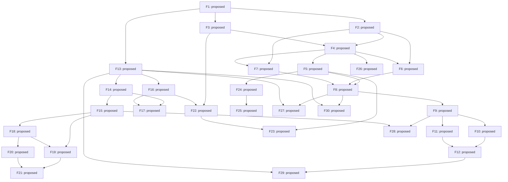

# Roadmap graph

Generated from `features.proposed.json`; review status: **proposed**.

Local readiness does not satisfy external prerequisites or host-workspace authority.

| ID | Milestone | Owner | State | Description |
| --- | --- | --- | --- | --- |
| F1 | M0 | rengine | proposed | Record the reviewed charter and one concrete pilot workflow. |
| F2 | M1 | rengine | proposed | Specify a project adapter contract that preserves native commands and policies. |
| F3 | M1 | rengine | proposed | Specify a verification result envelope with honest non-pass states. |
| F4 | M1 | rengine | proposed | Implement one local native-command runner with bounded process lifetime. |
| F5 | M1 | rengine | proposed | Write immutable, verifiable run bundles from runner results. |
| F6 | M1 | rengine | proposed | Describe and exercise the selected reLith check through a local adapter. |
| F7 | M1 | rengine | proposed | Describe and exercise the selected reSource check through a local adapter. |
| F8 | M1 | rengine | proposed | Demonstrate the same tool on both real engine pilots. |
| F9 | M2 | rengine | proposed | Package a minimal agent-neutral harness template with local policy extension. |
| F10 | M2 | nolf-improved | proposed | Adopt a pinned rEngine tool capability in the reLith workspace. |
| F11 | M2 | vtmb-vr | proposed | Adopt a pinned rEngine tool capability in the reSource workspace. |
| F12 | M2 | rengine | proposed | Prove independent tool upgrade and rollback in both consumers. |
| F13 | M3 | rengine | proposed | Define the catalog admission and compatibility record for real components. |
| F14 | M3 | rengine | proposed | Define reproducible dependency pins and explicit developer overrides. |
| F15 | M3 | rengine | proposed | Publish a reviewed local iklib consumption recipe and two fixture proofs. |
| F16 | M3 | rengine | proposed | Resolve the infra-vr embeddable packaging boundary from both host closures. |
| F17 | M3 | rengine | proposed | Prove pinned infra-vr consumption with both host-shaped build fixtures. |
| F18 | M4 | vtmb-vr | proposed | Complete the existing reSource core IK migration from its owning workspace. |
| F19 | M4 | nolf-improved | proposed | Complete the existing reLith IK migration with NOLF parameter parity. |
| F20 | M4 | vtmb-vr | proposed | Complete the separate reSource finger IK migration. |
| F21 | M4 | rengine | proposed | Record runtime adoption evidence by engine, game and supported profile. |
| F22 | M5 | rengine | proposed | Define report-to-reproduction metadata around existing infra-vr reports. |
| F23 | M5 | rengine | proposed | Represent oracle and manual/device evidence without replacing native gates. |
| F24 | M5 | rengine | proposed | Specify an explicit eligibility-checked development evidence export. |
| F25 | M5 | vr-port-agent-training | proposed | Demonstrate the evidence bridge in the training-owned intake path. |
| F26 | M6 | rengine | proposed | Coordinate explicitly reserved workspaces and scarce test resources. |
| F27 | M6 | rengine | proposed | Evaluate one next shared component against real duplicated host needs. |
| F28 | M6 | rengine | proposed | Prove a new host can adopt a capability without either game engine. |
| F29 | M6 | rengine | proposed | Define evidence-backed powered-by records for both engine families. |
| F30 | M6 | rengine | proposed | Audit the harness and decide the next bounded roadmap from measured results. |
